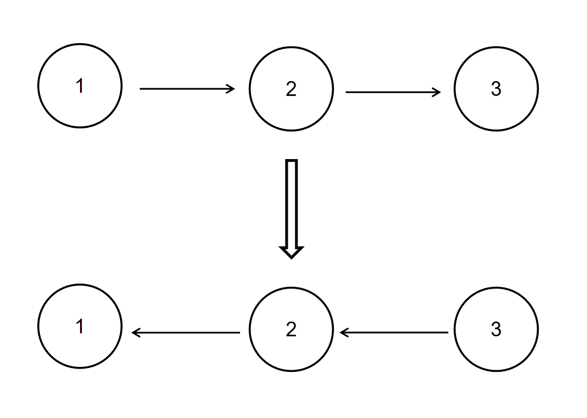

# 数据结构

> **PS：不适合初学者看，仅供复习用**

## 链表


> 选择链表之前需要考虑的事情（为什么要选择链表而不是选择数组？）
>
> 1. 不知道数据列表中会有几个元素
> 2. 不需要随机访问任何一个元素
> 3. 需要以常数式时间从数据列表中插入和删除元素（与数组不同，你不需要先移动数据列表中的每一个其他元素）

### 如何实现链表

```python
class Node:
  def __init__(self, value):
    self.value = value
    self.next = None
class LinkList:
  def __init__(self, head):
    self.head = head
  def append(self, new_node):
    current = self.head
    if current:
      while current.next:
        current = current.next
      current.next = new_node
    else:
      self.head = new_node
	def delete(self, value):
    """Delete the first node with a given value."""
    current = self.head
    if current.value == value:
      self.head = current.next
    else:
      while current:
        if current.value == value:
          break
        prev = current
        current = current.next
      if current == None:
        return
      prev.next = current.next
      current = None
   def insert(self, new_node, position):
     current = self.head
     pos = 0
     if position == 0:
        new_node.next = self.head
        self.head = new_node
     while current:
        if pos + 1 == position:
           new_node.next = current.next
           current.next = new_node
           return
         else:
            pos += 1
            current = current.next
        
```

### 参考题单

#### 反转链表

##### 简单 [反转链表](https://www.nowcoder.com/practice/75e878df47f24fdc9dc3e400ec6058ca?tpId=295&tqId=23286&ru=/exam/oj&qru=/ta/format-top101/question-ranking&sourceUrl=%2Fexam%2Foj%3Fpage%3D1%26tab%3D%25E7%25AE%2597%25E6%25B3%2595%25E7%25AF%2587%26topicId%3D354)

###### **描述**

给定一个单链表的头结点pHead(该头节点是有值的，比如在下图，它的val是1)，长度为n，反转该链表后，返回新链表的表头。

数据范围：  $0≤n≤1000$ 

要求：空间复杂度 $O(1)$ ，时间复杂度 $O(n)$  。

如当输入链表 ${1,2,3}$ 时，

经反转后，原链表变为 ${3,2,1}$ ，所以对应的输出为 ${3,2,1}$ 。

以上转换过程如下图所示：



**示例1**

输入：

```
{1,2,3}
```

返回值：

```
{3,2,1}
```

**示例2**

输入：

```
{}
```

返回值：

```
{}
```

说明：

```
空链表则输出空        
```

###### 代码1

```python
# class ListNode:
#     def __init__(self, x):
#         self.val = x
#         self.next = None
#
# 代码中的类名、方法名、参数名已经指定，请勿修改，直接返回方法规定的值即可
#
# 
# @param head ListNode类 
# @return ListNode类
#
class Solution:
    def ReverseList(self , head: ListNode) -> ListNode:
        if head == None:
            return head
        p = head
        pre = None
        while p:
            q = p.next
            p.next = pre
            pre = p
            p = q

        return pre
```

###### 思路1

> 一般来说，反转链表都用三个结点来实现，分别是前序结点`pre`、当前结点`cur`、后序结点`nxt`。


先把`cur.next`指向`pre`，然后往后面移动就可以了，循环结束时，`pre`指向的就是链表的最后一个结点，所以最后直接返回`pre`即可

递归

```python
class Solution:
    def ReverseList(self , head: ListNode) -> ListNode:
        def dfs(pre, cur):
            if cur is None:
                return pre
            nxt = cur.next
            cur.next = pre
            return dfs(cur, nxt)
        return dfs(None, head)
```

###### 代码2（头插法）

```python
# class ListNode:
#     def __init__(self, x):
#         self.val = x
#         self.next = None
#
# 代码中的类名、方法名、参数名已经指定，请勿修改，直接返回方法规定的值即可
#
# 
# @param head ListNode类 
# @return ListNode类
#
class Solution:
    def ReverseList(self , head: ListNode) -> ListNode:
        if head == None:
            return head
        res = ListNode(-1)
        res.next = head
        #前序节点
        pre = res
        cur = pre.next
        while cur.next:
            nxt = cur.next
            cur.next = nxt.next
            nxt.next = pre.next
            pre.next = nxt
        return res.next
```

###### 思路2


运用头插法，可以新建建立一个链表res，将每次的nxt插入到新链表的头上，那么我们需要：

1. 把`cur.next`指向`nxt.next`，即先让当前结点后移
2. 将`nxt`插入到`pre`的下一个
3. 令`pre.next`指向`nxt`，类似于后移

需要注意的是一开始定义的`res`头结点为-1，所以我们需要返回`res.next`。

##### 中等 [链表内指定区间反转](https://www.nowcoder.com/practice/b58434e200a648c589ca2063f1faf58c?tpId=295&tqId=654&ru=%2Fpractice%2F75e878df47f24fdc9dc3e400ec6058ca&qru=%2Fta%2Fformat-top101%2Fquestion-ranking&sourceUrl=%2Fexam%2Foj%3Fpage%3D1%26tab%3D%25E7%25AE%2597%25E6%25B3%2595%25E7%25AF%2587%26topicId%3D354)

###### 思路1 与上题类似，不赘述

```python
# class ListNode:
#     def __init__(self, x):
#         self.val = x
#         self.next = None
#
# 代码中的类名、方法名、参数名已经指定，请勿修改，直接返回方法规定的值即可
#
# 
# @param head ListNode类 
# @param m int整型 
# @param n int整型 
# @return ListNode类
#
class Solution:
    def reverseBetween(self , head: ListNode, m: int, n: int) -> ListNode:
        if m == n:
            return head
        pleft = None
        pre = None
        cur = head
        nxt = cur.next
        pos = 1
        while pos <= n:
            if pos < m - 1:
                pass
            elif pos == m - 1:
                pleft = cur
            elif m <= pos <= n:
                if pos == m:
                    tail = cur
                if pos == n:
                    hd = cur
                cur.next = pre
                pre = cur
            cur = nxt
            if cur:
                nxt = cur.next
            pos += 1
        print(cur)
        tail.next = cur
        if pleft:
            pleft.next = hd
        print(hd.val)
        if m == 1:return hd
        return head
```

###### 思路2 递归（看牛客官方题解）

> 大概就是 翻转要反转的这个部分，然后把它和前面的和后面的连起来
>
> 但是这个有一个坑，就是如果全要反转（主要是从第一个结点开始的问题（第一个前面没东西好连了））

不用函数的诡异代码：

```python
class Solution:
    def reverseBetween(self , head: ListNode, m: int, n: int) -> ListNode:
        if m == n:
            return head
        pleft = None
        pre = None
        cur = head
        nxt = cur.next
        pos = 1
        while pos <= n:
            if pos < m - 1:
                pass
            elif pos == m - 1:
                pleft = cur
            elif m <= pos <= n:
                if pos == m:
                    tail = cur
                if pos == n:
                    hd = cur
                cur.next = pre
                pre = cur
            cur = nxt
            if cur:
                nxt = cur.next
            pos += 1
        print(cur)
        tail.next = cur
        if pleft:
            pleft.next = hd
        print(hd.val)
        if m == 1:return hd
        return head
```


用递归（官方题解）

```python
class Solution:
    def __init__(self):
        self.temp = None
    def reverse(self, head: ListNode, n: int) -> ListNode:
        #只颠倒第一个节点，后续不管
        if n == 1: 
            self.temp = head.next
            return head
        #进入子问题
        node = self.reverse(head.next, n - 1) 
        #反转
        head.next.next = head 
        #每个子问题反转后的尾拼接第n个位置后的节点
        head.next =  self.temp 
        return node
    
    def reverseBetween(self , head: ListNode, m: int, n: int) -> ListNode:
        #从第一个节点开始
        if m == 1: 
            return self.reverse(head, n)
        #缩减子问题
        node = self.reverseBetween(head.next, m - 1, n - 1) 
        #拼接已翻转
        head.next = node 
        return head
```


```python
# class ListNode:
#     def __init__(self, x):
#         self.val = x
#         self.next = None
#
# 代码中的类名、方法名、参数名已经指定，请勿修改，直接返回方法规定的值即可
#
# 
# @param lists ListNode类一维数组 
# @return ListNode类
#
class Solution:
    def merge_2(self, p1, p2) -> ListNode:
        pre = ListNode(-1)
        p = pre
        if p1 is None:
            return p2
        if p2 is None:
            return p1
        while p1 and p2:
            if p1.val < p2.val:
                p.next = p1
                p1 = p1.next
            else:
                p.next = p2
                p2 = p2.next
            p = p.next
        if p1:
            p.next = p1
        elif p2:
            p.next = p2
        return pre.next
    
    def divide_merge(self, lists, left, right):
        if left > right:
            return None
        elif left == right:
            return lists[left]
        mid = (int)((left + right) / 2)
        return self.merge_2(self.divide_merge(lists, left, mid), self.divide_merge(lists, mid + 1, right))
    def mergeKLists(self , lists: List[ListNode]) -> ListNode:
        return self.divide_merge(lists, 0, len(lists) - 1)
```

#### 快慢指针

##### 简单 [判断链表中是否有环](https://nowcoder.com/practice/650474f313294468a4ded3ce0f7898b9?tpId=295&tqId=605&ru=/exam/company&qru=/ta/format-top101/question-ranking&sourceUrl=%2Fexam%2Fcompany)

##### 中等 [链表中环的入口结点](https://www.nowcoder.com/practice/253d2c59ec3e4bc68da16833f79a38e4?tpId=295&tqId=23449&ru=%2Fpractice%2F886370fe658f41b498d40fb34ae76ff9&qru=%2Fta%2Fformat-top101%2Fquestion-ranking&sourceUrl=%2Fexam%2Fcompany)


#### （会员）入门 [**删除链表峰值**](https://www.nowcoder.com/practice/30a06e4e4aa549198d85deef1bab6d25?tpId=354&tqId=10595857&ru=%2Fpractice%2F30a06e4e4aa549198d85deef1bab6d25&qru=%2Fta%2Finterview-202-top%2Fquestion-ranking&sourceUrl=%2Fexam%2Foj)

#### （会员）简单[**牛群排列去重**](https://www.nowcoder.com/practice/8cabda340ac6461984ef9a1ad66915e4?tpId=354&tqId=10591390&ru=%2Fpractice%2F30a06e4e4aa549198d85deef1bab6d25&qru=%2Fta%2Finterview-202-top%2Fquestion-ranking&sourceUrl=%2Fexam%2Foj)

## 参考链接

[freecodecamp](https://www.freecodecamp.org/chinese/news/introduction-to-linked-lists-in-python/)