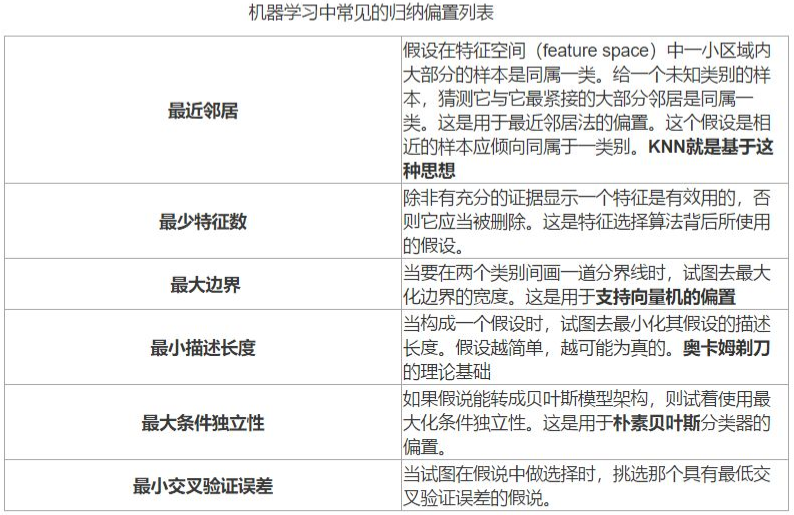

# 1 机器学习概述

## 理论知识

### **1.1 机器学习的定义**

> 人的“经验”对应计算机中的“数据”，让**计算机来学习这些经验数据**，生成一个**算法模型**，在面对**新**的情况中，计算机便能作出有效的判断，这便是机器学习。

另一本经典教材的作者Mitchell给出了一个形式化的定义，假设：

 - $P$：计算机程序在某任务类$T$上的性能。
 - $T$：计算机程序希望实现的任务类。
 - $E$：表示经验，即历史的数据集。

若该计算机程序通过利用经验$E$在任务$T$上获得了性能$P$的改善，则称该程序对$E$​进行了学习。

### **1.2 机器学习的一些基本术语**

#### 数据

假设我们收集了一批西瓜的数据，例如：

+ (色泽=青绿;根蒂=蜷缩;敲声=浊响)，
+  (色泽=乌黑;根蒂=稍蜷;敲声=沉闷)，
+  (色泽=浅自;根蒂=硬挺;敲声=清脆)……

每对括号内是一个西瓜的记录，定义：

+ **数据集**：这组记录的集合称为一个数据集

$$
D = \{\mathbf{x_1},\mathbf{x_2},...,\mathbf{x_n}\}
$$

 - **实例（instance）/样本（sample）**：一个西瓜的描述(每一条记录)

$$
\mathbf{x_i}=\{x_{i1},x_{i2},...x_{ij}\}
$$

 - **属性（attribute）/特征（feature）**：例如“色泽”，“根蒂”，“敲声”  ，单个的特点为特征或属性。
 - **属性值**：例如“青绿”，“乌黑”
 - **特征向量**：[“色泽”，“根蒂”，“敲声”]。
 - **维数（dimensionality）**，一个样本的特征数。该西瓜的例子维数为3，当维数非常大时，也就是现在说的“维数灾难”。

---

#### 训练&测试&泛化

计算机程序学习经验数据生成算法模型的过程中，每一条记录称为一个“训练样本”，同时在训练好模型后，我们希望使用新的样本来测试模型的效果，则每一个新的样本称为一个“测试样本”。定义：	

 - **训练集（trainning set）**：所有训练样本的集合 [特殊]。
 - **测试集（test set）**：所有测试样本的集合 [一般]。  
 - **泛化能力（generalization）**：机器学习出来的模型适用于**新样本**的能力，即从特殊到一般。

---

#### 分类&回归

西瓜的例子中，我们是想计算机通过学习西瓜的特征数据，训练出一个决策模型，来判断一个新的西瓜是否是好瓜。可以得知我们预测的是：西瓜是好是坏，即好瓜与差瓜两种，是离散值。同样地，也有通过历年的人口数据，来预测未来的人口数量，人口数量则是连续值。定义：	

 - **分类（classification）**：预测值为**离散值**的问题，例如“好瓜”，“坏瓜”。
 - **回归（regression）**：预测值为**连续值**的问题，例如西瓜成熟度0.95、0.37

---

#### 监督/无监督学习

我们预测西瓜是否是好瓜的过程中，很明显对于训练集中的西瓜，我们事先已经知道了该瓜是否是好瓜，学习器通过学习这些好瓜或差瓜的特征，从而总结出规律，即训练集中的西瓜我们都做了标记，称为**标记信息**。但也有没有标记信息的情形，例如：我们想将一堆西瓜根据特征分成**两个小堆**，使得某一堆的西瓜**尽可能相似**，即都是好瓜或差瓜，对于这种问题，我们**事先并不知道**西瓜的好坏，样本没有标记信息。定义：	

 - **监督学习（supervised learning）**：训练数据**有标记信息**的学习任务，容易知道上面所描述的**分类和回归**都是监督学习的范畴。
 - **无监督学习（unsupervised learning）**：训练数据**没有标记信息**的学习任务，常见的有**聚类**和**关联规则**。

#### 假设空间

> 假设空间就是将属性可能的取值**全部列举出**组成的样本。

+ 学习过程：在所有假设(hypothesis)组成的空间中进行搜索的过程
+ 目标: 找到与训练集**“匹配” (fit)**的假设
+ 假设空间的大小：

$$
n_1 \times n_2 \times n_3 + 1
$$

在数据集当中，色泽有两种取值，根蒂和敲声分别有三种取值，这三种属性还可以取值为通配符'\*'，代表该**属性无论取什么值都合适** ；此外，还需要考虑极端的情况，**就是世界上不存在“好瓜”这个概念，此时取值为Ø**，所以在当前数据集下，假设空间中样本的数量应为$3*4*4+1=49$​。

#### 版本空间

> 版本空间(version space): 与训练集一致的假设集合(版本空间就是**与已知样本一致的所有假设的一个子集**。)——根据已知的数据集，将**与正样本不一致**的、与负样本一致的从假设空间中**删除**，得到的即为版本空间。

（1，（色泽＝青绿、根蒂＝蜷缩、敲声＝浊响），好瓜）

（2，（色泽＝乌黑、根蒂＝蜷缩、敲声＝浊响），好瓜）

（3，（色泽＝青绿、根蒂＝硬挺、敲声＝清脆），不是好瓜）

（4，（色泽＝乌黑、根蒂＝稍蜷、敲声＝沉闷），不是好瓜）

同时，我们根据样本数据可以知道，好瓜是存在的，所以需要删除49空集的样本。最终，根据样本数据得到的版本空间为：

4（色泽＝\*、根蒂＝蜷缩、敲声＝\*）

7（色泽＝\*、根蒂＝\*、敲声＝浊响）

22（色泽＝\*、根蒂＝蜷缩、敲声＝浊响）

#### 归纳偏好

> 机器学习算法在学习过程中对某种类型假设的 **偏好**，称为 **归纳偏好**。归纳偏好可以看作学习算法自身在一个庞大的假设空间中对假设进行 **选择** 的 **启发式** 或 “**价值观**”。

+ 例如，深度神经网络偏好性地认为，层次化处理信息有更好效果；卷积神经网络认为信息具有空间局部性，可用滑动卷积共享权重的方式降低参数空间；循环神经网络 则将时序信息纳入考虑，强调顺序重要性；图网络 则认为中心节点与邻居节点的相似性会更好地引导信息流动。
+ 事实上，将 Inductive Bias 翻译成 归纳性偏好 可能更符合我们的理解和认知。
  通常，模型 容量 (capacity) 很大但 Inductive Bias 匮乏 则容易 过拟合 (overfitting)，如 Transformer。
+ KNN 中假设特征空间中相邻的样本倾向于属于同一类
+ SVM 中假设好的分类器应该最大化类别边界距离

##### “奥卡姆剃刀” 原理

+ 希望相同性能下，学习到的**模型复杂度更低**
+ 

#### “没有免费的午餐”定理

前提：所有“问题” 出现的机会相同、 或所有问题同等重要，但是实际情形并非如此； 我们通常只关注自己正在试图解决的问题，实际情形并非如此； 我们通常只关注自己正在试图解决的问题

### 1.3 机器学习历史

+ 第一阶段：推理期（1956-1960s）

  > 认为只要给机器赋予逻辑推理能力，机器就具有智能。
  >
  > 但是，研究者们发现仅有逻辑推理能力是不够的，还需要先总结出知识，因此，到了下一个阶段——知识期。

+ 第二阶段：知识期（1970s-1980s）

  > 认为要使机器具有智能，就必须设法使机器拥有知识。
  >
  > 但是，研究者们发现要先总结出知识在“教”给系统较难实现，因此，发展到下一阶段，学习期，也就是我们现阶段所处的时期。

+ 第三阶段：学习期（1990s-现在）

> 出发点是让系统自己进行学习，总结出知识。
>
> 现在我们处于第三阶段——学习期。

## 习题

### 

### 人工智能、机器学习、和深度学习的关系

人工智能、机器学习、和深度学习这三者是由广至深，存在着包含和被包含的关系。

+ 人工智能（Artificial Intelligence, AI）

   人工智能是最广泛的概念，它指的是让机器执行能够体现智能的行为的技术。这些智能行为包括但不限于学习、推理、解决问题、语言理解、视觉识别等。人工智能的目标是创造能够执行各种复杂任务的机器，这些任务在过去通常需要人类来完成。

+ 机器学习（Machine Learning, ML）

   机器学习是实现人工智能的一种方法。它专注于开发算法，让计算机能够从数据中学习，并根据学习到的信息做出判断或预测。与传统的程序设计不同，机器学习的核心不在于为计算机编写具体的指令来处理任务，而是让计算机通过分析数据自动学习如何解决问题。因此，机器学习是实现AI的一种手段，它能够让计算机在没有明确指令的情况下增强其执行特定任务的能力。

+ 深度学习（Deep Learning, DL）

   深度学习仅是机器学习中的一个小分支，它使用深层神经网络模拟人脑分析和学习的机制。深度学习算法通过使用多层的神经网络处理数据，能够识别复杂的模式和特征。这种方法特别适合于处理大规模的、高维度的数据，如图像和语音识别任务。深度学习在许多领域取得了显著的成就，包括自然语言处理、计算机视觉和自动驾驶汽车。

## 参考文章

[CSDN【机器学习】浅谈 归纳偏置 (Inductive Bias)](https://blog.csdn.net/qq_39478403/article/details/121107057)

**[Machine-learning-learning-notes](https://github.com/Vay-keen/Machine-learning-learning-notes)**