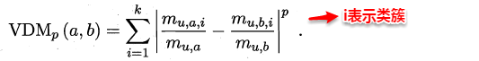
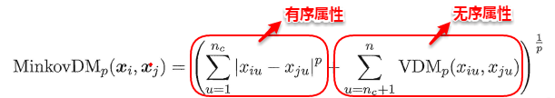
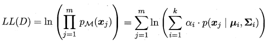
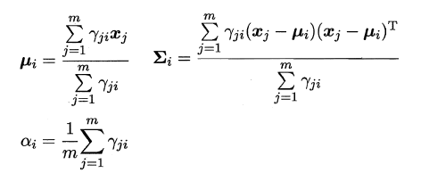
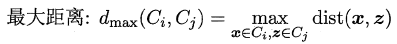

上篇主要介绍了一种机器学习的通用框架--集成学习方法，首先从准确性和差异性两个重要概念引出集成学习“**好而不同**”的四字真言，接着介绍了现阶段主流的三种集成学习方法：AdaBoost、Bagging及Random Forest，AdaBoost采用最小化指数损失函数迭代式更新样本分布权重和计算基学习器权重，Bagging通过自助采样引入样本扰动增加了基学习器之间的差异性，随机森林则进一步引入了属性扰动，最后简单概述了集成模型中的三类结合策略：平均法、投票法及学习法，其中Stacking是学习法的典型代表。本篇将讨论无监督学习中应用最为广泛的学习算法--聚类。

# **10、聚类算法**

聚类是一种经典的**无监督学习**方法，**无监督学习的目标是通过对无标记训练样本的学习，发掘和揭示数据集本身潜在的结构与规律**，即**不依赖于训练数据集的类标记信息**。聚类则是试图将数据集的样本划分为若干个互不相交的类簇，从而每个簇对应一个潜在的类别。

+ 聚类目标：
  + 将数据集中的样本划分为若干个通常不相交的子集——**簇（cluster）**
  + 直观上来说是将相似的样本聚在一起

+ 聚类既可以作为一个单独过程（用于找寻数据内在的分布结构），也可作为分类等其他学习任务的前驱过程。

形式化地说，假定样本集 $ D = \{x_1, x_2, \ldots, x_m\} $ 包含 $ m $ 个无标记样本，
每个样本 $ x_i = (x_{i1}, x_{i2}, \ldots, x_{in}) $ 是一个 $ n $ 维特征向量，则聚类算法将样本集 $ D $ 划分为 $ k $ 个不相交的簇 $ \{C_1, C_2, \ldots, C_k\} $，其中 $ \cup_{i=1}^k C_i = D $ 且 $ C_i \cap C_j = \emptyset $ (对于 $ i \neq j $)。

相应地，我们用 $ c_i \in \{1, 2, \ldots, k\} $ 表示样本 $ x_i $ 的“簇标记”（cluster label），即 $ x_i \in C_{c_i} $。于是，聚类的结果可用包含 $ m $ 个元素的簇标记向量 $ \mathbf{c} = (c_1, c_2, \ldots, c_m) $ 表示。

---

那首先的问题是如何来**度量相似性**（similarity measure）呢？这便是**距离度量**，在生活中我们说差别小则相似，对应到多维样本，每个样本可以对应于高维空间中的一个数据点，若它们的距离相近，我们便可以称它们相似。

那接着如何来评价聚类结果的好坏呢？这便是**性能度量**，性能度量为评价聚类结果的好坏提供了一系列有效性指标。

## **10.1 性能度量**

+ 聚类性能度量亦称聚类**“有效性指标 ”(validity index)**。
+ 与监督学习中的性能度量作用相似，对聚类结果，我们需通过某种性能度量来评估其好坏；另一方面，若明确了最终将要使用的性能度量，则可直接将其作为聚类过程的优化目标，从而更好地得到符合要求的聚类结果。
+ 希望：
  + 聚类结果的 **“簇内相似度 ”(intra-cluster similarity)高且“簇间相似度”(inter-cluster similarity)低**

---

由于聚类算法不依赖于样本的真实类标，就不能像监督学习的分类那般，通过计算分对分错（即精确度或错误率）来评价学习器的好坏或作为学习过程中的优化目标。一般聚类有两类性能度量指标：**外部指标**和**内部指标**。

+ “外部指标”（external index）
  + 将聚类结果与某个“参考模型 ”(reference model)进行比较。
+ “内部指标”（internal index）
  + 直接考察聚类结果而不利用任何参考模型。

### **10.2.1 外部指标**

即将聚类结果与某个参考模型的结果进行比较，**以参考模型的输出作为标准，来评价聚类好坏**。

1. 给定数据集 $$ X = \{ x_1, x_2, \ldots, x_m \} $$。
2. 聚类得到的簇划分为 $$ C = \{ C_1, C_2, \ldots, C_k \} $$。
3. 参考模型给出的簇划分为 $$ C^* = \{ C_1^*, C_2^*, \ldots, C_l^* \} $$。
4. $$ A $$ 和 $$ A^* $$ 分别表示与 $$ C $$ 和 $$ C^* $$ 对应的簇标记向量。

我们将样本两两配对考虑，定义：
- $$ a = |SS| $$，其中 $$ SS = \{ (x_i, x_j) | A_i = A_j, A_i^* = A_j^*, i < j \} $$ 
- $$ b = |SD| $$，其中 $$ SD = \{ (x_i, x_j) | A_i = A_j, A_i^* \neq A_j^*, i < j \} $$ 
- $$ c = |DS| $$，其中 $$ DS = \{ (x_i, x_j) | A_i \neq A_j, A_i^* = A_j^*, i < j \} $$ 
- $$ d = |DD| $$，其中 $$ DD = \{ (x_i, x_j) | A_i \neq A_j, A_i^* \neq A_j^*, i < j \} $$ 

其中，集合 $$ SS $$ 包含了在 $$ C $$ 中隶属于相同簇且在 $$ C^* $$ 中也隶属于相同簇的样本对，集合 $$ SD $$ 包含了在 $$ C $$ 中隶属于相同簇但在 $$ C^* $$ 中隶属于不同簇的样本对，集合 $$ DS $$ 包含了在 $$ C $$ 中隶属于不同簇但在 $$ C^* $$ 中隶属于相同簇的样本对，集合 $$ DD $$ 包含了在 $$ C $$ 中隶属于不同簇且在 $$ C^* $$ 中也隶属于不同簇的样本对。由于每个样本对 $$ (x_i, x_j) $$ ( $$ i < j $$ ) 仅能出现在一个集合中，因此有 $$ a + b + c + d = \frac{m(m-1)}{2} $$ 成立。

#### 样本对计算

如果我们有 $$ m $$ 个样本，那么可以从中任意选出两个样本形成一个样本对。样本对的总数可以通过组合数学公式计算：

$$ \binom{m}{2} = \frac{m(m-1)}{2} $$

这个公式表示从 $$ m $$​ 个样本中选出 2 个样本的组合数，也就是所有可能的样本对数。

---

显然a和d代表着聚类结果好坏的正能量，b和c则表示参考结果和聚类结果相矛盾，基于这四个值可以导出以下常用的外部评价指标：

#### 兰德系数（Rand Index, RI）
兰德系数通过衡量样本对在两种划分下的一致性来评估聚类结果，定义如下：

$$
\text{RI} = \frac{a + d}{a + b + c + d} = \frac{2(a+d)}{m(m-1)}
$$
其中，分子 $$ a + d $$ 表示在两种划分下样本对的划分一致性，分母 $$ a + b + c + d $$ 表示所有可能的样本对数。

#### Jaccard系数（Jaccard Coefficient，简称JC）

$$
JC = \frac{a}{a+b+c}
$$

#### FM指数（Fowlkes and Mallows Index，简称FMI）

$$
FMI = \sqrt{\frac{a}{a+b} \cdot \frac{a}{a+c}}
$$

+ 取值范围都是0-1，值越大越好

### **10.2.2 内部指标**

内部指标即不依赖任何外部模型，直接对聚类的结果进行评估，聚类的目的是想将那些相似的样本尽可能聚在一起，不相似的样本尽可能分开，直观来说：**簇内高内聚紧紧抱团，簇间低耦合老死不相往来**。定义：

基于上面的四个距离，可以导出下面这些常用的内部评价指标：

## **10.2 距离度量**

谈及距离度量，最熟悉的莫过于**欧式距离**了，从年头一直用到年尾的距离计算公式：即对应属性之间相减的平方和再开根号。度量距离还有其它的很多经典方法，通常它们需要满足一些基本性质：

+ 非负性： $dist(x_i, x_j)\ge 0$
+ 同一性：$dist(x_i, x_j) = 0$ $x_i=x_j$​
+ 对称性：$dist(x_i,x_j)=dist(x_j,x_i)$​
+ 直递性：$dist(x_i, x_j) \le dist(x_i,x_k) + dist(x_k,x_j)$ ，即两边之和大于第三边

最常用的距离度量方法是**“闵可夫斯基距离”（Minkowski distance)**：

当p=1时，闵可夫斯基距离即**曼哈顿距离（Manhattan distance）**：

当p=2时，闵可夫斯基距离即**欧氏距离（Euclidean distance）**：

我们知道属性分为两种：**连续属性**和**离散属性**（有限个取值）。对于连续值的属性，一般都可以被学习器所用，有时会根据具体的情形作相应的预处理，例如：归一化等；而对于离散值的属性，需要作下面进一步的处理：

> 若属性值之间**存在序关系**，则可以将其转化为连续值，例如：身高属性“高”“中等”“矮”，可转化为{1, 0.5, 0}。
> 若属性值之间**不存在序关系**，则通常将其转化为向量的形式，例如：性别属性“男”“女”，可转化为{（1,0），（0,1）}。

在进行距离度量时，易知**连续属性和存在序关系的离散属性都可以直接参与计算**，因为它们都可以反映一种程度，我们称其为“**有序属性**”；而对于不存在序关系的离散属性，我们称其为：“**无序属性**”，显然无序属性再使用闵可夫斯基距离就行不通了。

**对于无序属性，我们一般采用VDM进行距离的计算**，例如：对于离散属性的两个取值a和b，定义：

于是，在计算两个样本之间的距离时，我们可以将闵可夫斯基距离和VDM混合在一起进行计算：

若我们定义的距离计算方法是用来度量相似性，例如下面将要讨论的聚类问题，即距离越小，相似性越大，反之距离越大，相似性越小。这时距离的度量方法并不一定需要满足前面所说的四个基本性质，这样的方法称为：**非度量距离（non-metric distance）**。

## **10.3 原型聚类**

原型聚类即“**基于原型的聚类**”（prototype-based clustering），原型表示模板的意思，就是通过**参考一个模板向量或模板分布的方式来完成聚类的过程**，常见的**K-Means**便是**基于簇中心来**实现聚类，**混合高斯聚类**则是**基于簇分布**来实现聚类。

### **10.3.1 K-Means**

K-Means的思想十分简单，**首先随机指定类中心，根据样本与类中心的远近划分类簇，接着重新计算类中心，迭代直至收敛**。但是其中迭代的过程并不是主观地想象得出，事实上，若将样本的类别看做为“隐变量”（latent variable），类中心看作样本的分布参数，这一过程正是通过**EM算法**的两步走策略而计算出，其根本的目的是为了最小化平方误差函数E：
$$
E = \sum^k_{i=1}\sum_{x\in{C_i}}||\mathbf{x}-\mathbf{\mu_i}||^2_2
$$
K-Means的算法流程如下所示：

来个K-means例子，感觉k-means很有可能考

聚簇 $k=2$，算法开始时选取两个样本 $x_3$ 和$x_6$作为初始均值向量，即
$$
\mu_1 = (0.634, 0.264)\quad \quad \mu_2 = (0.403, 0.237)
$$
考察样本 $x_1$，它与当前均值向量 $\mu_1, \mu_2$的距离分别为
$$
d_{\mu_{11}} = \sqrt{(x_1 - \mu_{1_x})^2 + (y_1 - \mu_{1_y})^2} = \sqrt{(0.697-0.634)^2+(0.460-0.264)^2}=0.206
$$

$$
d_{\mu_{21}} = \sqrt{(x_1 - \mu_{2_x})^2 + (y_1 - \mu_{2_y})^2} = \sqrt{(0.697-0.403)^2+(0.460-0.237)^2}=0.369
$$

以此类推，得到$x_1$～$x_{10}$与当前均值向量 $\mu_1, \mu_2$的距离如下表：

|     $x_i$      | $d_{\mu_{1i}}$ | $d_{\mu_{2i}}$ | 分类 |
| :------------: | :------------: | :------------: | :--: |
| [0.697, 0.460] |     0.206      |     0.369      |  1   |
| [0.774, 0.376] |     0.179      |     0.396      |  1   |
| [0.634, 0.264] |      0.0       |     0.233      |  1   |
| [0.608, 0.318] |      0.06      |      0.22      |  1   |
| [0.556, 0.215] |     0.092      |     0.155      |  1   |
| [0.403, 0.237] |     0.233      |      0.0       |  2   |
| [0.481, 0.149] |     0.191      |     0.118      |  2   |
| [0.437, 0.211] |     0.204      |     0.043      |  2   |
| [0.666, 0.091] |     0.176      |     0.301      |  1   |
| [0.243, 0.267] |     0.391      |     0.163      |  2   |

$$
C_1:\{x_1, x_2, x_3, x_4, x_5, x_9\} \newline
C_2:\{x_6, x_7, x_8, x_{10}\}
$$

新的向量均值：
$$
\mu'_{1_x} = \frac{1}{|C_1|}\sum_{x\in C_i}\mathbf{x_i}=\frac{1}{6}(0.697+0.774+0.634+0.608+0.556+0.666)=0.656
$$

$$
\mu'_{1_y} = \frac{1}{|C_1|}\sum_{y\in C_i}\mathbf{y_i}=\frac{1}{6}(0.460+0.376+0.264+0.318+0.215+0.091)=0.287
$$

$$
\mu'_{2_x} = \frac{1}{|C_2|}\sum_{x\in C_i}\mathbf{x_i}=\frac{1}{4}(0.403+0.481+0.437+0.243)=0.391
$$

$$
\mu'_{2_y} = \frac{1}{|C_2|}\sum_{y\in C_i}\mathbf{y_i}=\frac{1}{4}(0.237+0.149+0.211+0.267)=0.216
$$

$$
\mu'_1 = (0.656, 0.287)\quad \quad \mu'_2 = (0.391, 0.216)
$$

以此类推，得到$x_1$～$x_{10}$与当前均值向量 $\mu’_1, \mu’_2$的距离如下表：

|     $x_i$      | $d_{\mu_1}$ | $d_{\mu_2}$ | 分类 |
| :------------: | :---------: | :---------: | :--: |
| [0.697, 0.460] |    0.178    |    0.391    |  1   |
| [0.774, 0.376] |    0.148    |    0.415    |  1   |
| [0.634, 0.264] |    0.032    |    0.248    |  1   |
| [0.608, 0.318] |    0.057    |    0.24     |  1   |
| [0.556, 0.215] |    0.123    |    0.165    |  1   |
| [0.403, 0.237] |    0.258    |    0.024    |  2   |
| [0.481, 0.149] |    0.223    |    0.112    |  2   |
| [0.437, 0.211] |    0.232    |    0.046    |  2   |
| [0.666, 0.091] |    0.197    |    0.302    |  1   |
| [0.243, 0.267] |    0.413    |    0.157    |  2   |

$$
C_1:\{x_1, x_2, x_3, x_4, x_5, x_9\} \newline
C_2:\{x_6, x_7, x_8, x_{10}\}
$$

新的向量均值：
$$
\mu''_1 = (0.656, 0.287)\quad \quad \mu''_2 = (0.391, 0.216)
$$
与第一次迭代的向量均值相同。

因此，两类西瓜分别为
$$
C_1:\{x_1, x_2, x_3, x_4, x_5, x_9\} \newline
C_2:\{x_6, x_7, x_8, x_{10}\}
$$

### **10.3.2 学习向量量化（LVQ）**

LVQ也是基于原型的聚类算法，与K-Means不同的是，**LVQ使用样本真实类标记辅助聚类**，首先LVQ根据样本的类标记，从各类中分别随机选出一个样本作为该类簇的原型，从而组成了一个**原型特征向量组**，接着从样本集中随机挑选一个样本，计算其与原型向量组中每个向量的距离，并选取距离最小的原型向量所在的类簇作为它的划分结果，再与真实类标比较。

> **若划分结果正确，则对应原型向量向这个样本靠近一些**
> **若划分结果不正确，则对应原型向量向这个样本远离一些**

LVQ算法的流程如下所示：

### **10.3.3 高斯混合聚类**

现在可以看出K-Means与LVQ都试图以类中心作为原型指导聚类，高斯混合聚类则采用高斯分布来描述原型。现假设**每个类簇中的样本都服从一个多维高斯分布，那么空间中的样本可以看作由k个多维高斯分布混合而成**。

对于多维高斯分布，其概率密度函数如下所示：

其中u表示均值向量，∑表示协方差矩阵，可以看出一个多维高斯分布完全由这两个参数所确定。接着定义高斯混合分布为：

α称为混合系数，这样空间中样本的采集过程则可以抽象为：**（1）先选择一个类簇（高斯分布），（2）再根据对应高斯分布的密度函数进行采样**，这时候贝叶斯公式又能大展身手了：

此时只需要选择PM最大时的类簇并将该样本划分到其中，看到这里很容易发现：这和那个传说中的贝叶斯分类不是神似吗，都是通过贝叶斯公式展开，然后计算类先验概率和类条件概率。但遗憾的是：**这里没有真实类标信息，对于类条件概率，并不能像贝叶斯分类那样通过最大似然法美好地计算出来**，因为这里的样本可能属于所有的类簇，这里的似然函数变为：

可以看出：简单的最大似然法根本无法求出所有的参数，这样PM也就没法计算。**这里就要召唤出之前的EM大法，首先对高斯分布的参数及混合系数进行随机初始化，计算出各个PM（即γji，第i个样本属于j类），再最大化似然函数（即LL（D）分别对α、u和∑求偏导 ），对参数进行迭代更新**。

高斯混合聚类的算法流程如下图所示：

## **10.4 密度聚类**

密度聚类则是基于密度的聚类，它从样本分布的角度来考察样本之间的可连接性，并基于可连接性（密度可达）不断拓展疆域（类簇）。其中最著名的便是**DBSCAN**算法，首先定义以下概念：

简单来理解DBSCAN便是：**找出一个核心对象所有密度可达的样本集合形成簇**。首先从数据集中任选一个核心对象A，找出所有A密度可达的样本集合，将这些样本形成一个密度相连的类簇，直到所有的核心对象都遍历完。DBSCAN算法的流程如下图所示：

## **10.5 层次聚类**

层次聚类是一种基于树形结构的聚类方法，常用的是**自底向上**的结合策略（**AGNES算法**）。假设有N个待聚类的样本，其基本步骤是：

> 1.初始化-->把每个样本归为一类，计算每两个类之间的距离，也就是样本与样本之间的相似度；
> 2.寻找各个类之间最近的两个类，把他们归为一类（这样类的总数就少了一个）；
> 3.重新计算新生成的这个**类与各个旧类之间的相似度**；
> 4.重复2和3直到所有样本点都归为一类，结束。

可以看出其中最关键的一步就是**计算两个类簇的相似度**，这里有多种度量方法：

	* 单链接（single-linkage）:取类间最小距离。

	* 全链接（complete-linkage）:取类间最大距离

	* 均链接（average-linkage）:取类间两两的平均距离

很容易看出：**单链接的包容性极强，稍微有点暧昧就当做是自己人了，全链接则是坚持到底，只要存在缺点就坚决不合并，均连接则是从全局出发顾全大局**。层次聚类法的算法流程如下所示：

