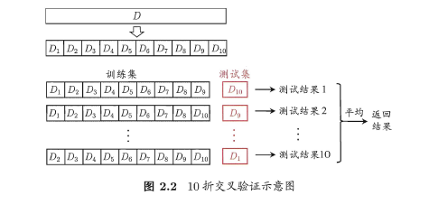
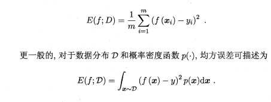
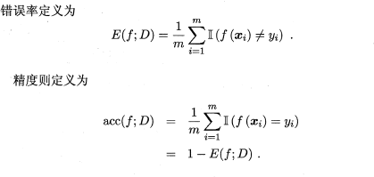
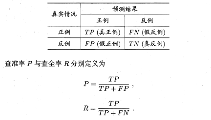
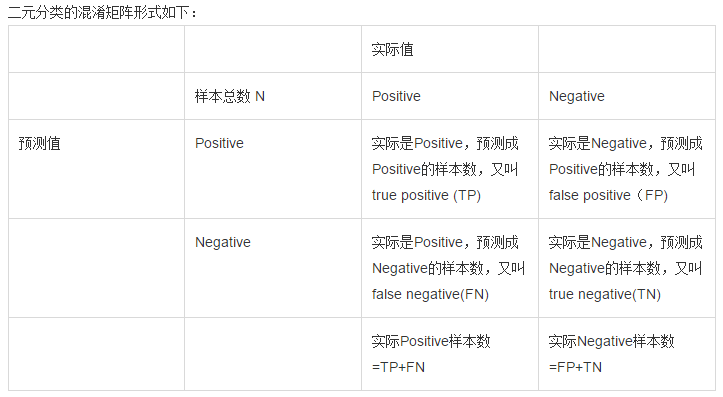
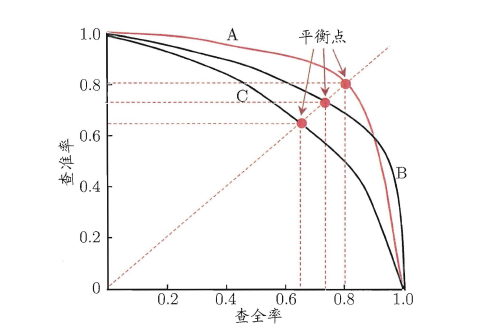
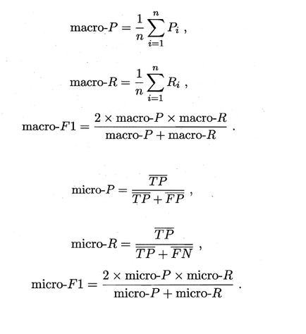
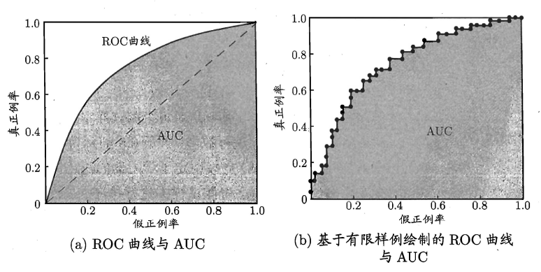
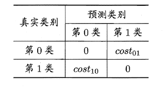
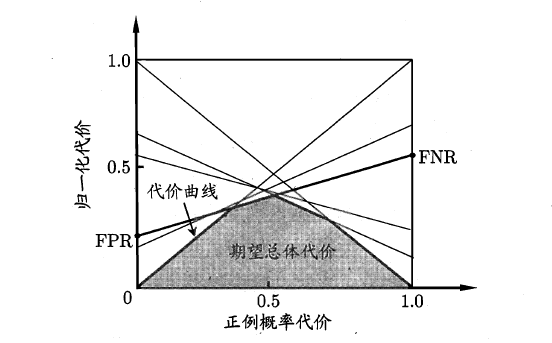

# **2  模型的评估与选择**

## **2.1 误差与过拟合**

我们将学习器对样本的实际预测结果与样本的真实值之间的差异成为：**误差（error）**。定义：	

 - 在**训练集**上的误差称为**训练误差（training error）**或**经验误差（empirical error）**。
 - 在**测试集**上的误差称为**测试误差（test error）**。
 - 学习器在**所有新样本**上的误差称为**泛化误差（generalization error）**。

显然，我们希望得到的是在新样本上表现得很好的学习器，**即泛化误差小的学习器。**

注意⚠️：经验误差不是越小越好！！！（可能会出现过拟合）

因此，我们应该让学习器尽可能地从训练集中学出普适性的“一般特征”，这样在遇到新样本时才能做出正确的判别。然而，当学习器把训练集学得“太好”的时候，即把一些训练样本的自身特点当做了普遍特征；同时也有学习能力不足的情况，即训练集的基本特征都没有学习出来。我们定义：

 - 学习**能力过强**，以至于把训练样本所包含的不太一般的特性都学到了，称为：**过拟合（overfitting）**。
 - 学习**能力太差**，训练样本的一般性质尚未学好，称为：**欠拟合（underfitting）**。

可以得知：在过拟合问题中，训练误差十分小，但测试误差教大；在欠拟合问题中，训练误差和测试误差都比较大。目前，**欠拟合问题比较容易克服，例如增加迭代次数等，但过拟合问题还没有十分好的解决方案，过拟合是机器学习面临的关键障碍**。

## **2.2 评估方法**

在现实任务中，我们往往有多种算法可供选择，那么我们应该选择哪一个算法才是最适合的呢？如上所述，我们希望得到的是泛化误差小的学习器，理想的解决方案是对模型的泛化误差进行评估，然后选择泛化误差最小的那个学习器。但是，泛化误差指的是模型在所有新样本上的适用能力，我们无法直接获得泛化误差。

因此，通常我们采用一个“测试集”来测试学习器对新样本的判别能力，然后以“测试集”上的“测试误差”作为“泛化误差”的近似。显然：我们选取的测试集应尽可能与训练集互斥，下面用一个小故事来解释why：

假设老师出了10 道习题供同学们练习，考试时老师又用同样的这10道题作为试题，可能有的童鞋只会做这10 道题却能得高分，很明显：这个考试成绩并不能有效地反映出真实水平。回到我们的问题上来，我们希望得到泛化性能好的模型，好比希望同学们课程学得好并获得了对所学知识"举一反三"的能力；训练样本相当于给同学们练习的习题，测试过程则相当于考试。显然，若测试样本被用作训练了，则得到的将是过于"乐观"的估计结果。

## **2.3 训练集与测试集的划分方法**

如上所述：我们希望用一个“测试集”的“测试误差”来作为“泛化误差”的近似，因此我们需要对初始数据集进行有效划分，划分出互斥的“训练集”和“测试集”。下面介绍几种常用的划分方法：

### **2.3.1 留出法**

将数据集D划分为两个互斥的集合，一个作为训练集$S$，一个作为测试集$T$，满足$D=S∪T$且$S∩T=∅$，常见的划分为：大约2/3-4/5的样本用作训练，剩下的用作测试。需要注意的是：训练/测试集的划分要尽**可能保持数据分布的一致性**，以避免由于分布的差异引入额外的偏差，常见的做法是**采取分层抽样**。同时，由于划分的随机性，单次的留出法结果往往不够稳定，一般要采用若干次随机划分，重复实验取平均值的做法。

### **2.3.2 交叉验证法**

将数据集$D$划分为$k$个大小相同的互斥子集，满足$D=D1∪D2∪...∪Dk，Di∩Dj=∅（i≠j）$，同样地尽可能保持数据分布的一致性，即采用分层抽样的方法获得这些子集。交叉验证法的思想是：每次用$k-1$个子集的并集作为训练集，余下的那个子集作为测试集，这样就有$K$种训练集/测试集划分的情况，从而可进行$k$次训练和测试，最终返回$k$次测试结果的均值。交叉验证法也称“$k$折交叉验证”，$k$最常用的取值是10，下图给出了10折交叉验证的示意图。

与留出法类似，将数据集$D$划分为$K$个子集的过程具有随机性，因此$K$折交叉验证通常也要重复$p$次，称为$p$次$k$折交叉验证，常见的是10次10折交叉验证，即进行了100次训练/测试。特殊地当划分的$k个子集的每个子集中只有一个样本时，称为“留一法”，显然，留一法的评估结果比较准确，但对计算机的消耗也是巨大的。

### **2.3.3 自助法**

我们希望评估的是用整个$D$训练出的模型。但在留出法和交叉验证法中，由于保留了一部分样本用于测试，因此实际评估的模型所使用的训练集比$D$小，这必然会引入一些因训练样本规模不同而导致的估计偏差。留一法受训练样本规模变化的影响较小，但计算复杂度又太高了。“自助法”正是解决了这样的问题。

自助法的基本思想是：给定包含$m$个样本的数据集$D$，每次随机从$D$ 中挑选一个样本，将其拷贝放入$D'$，然后再将该样本放回初始数据集$D$ 中，使得该样本在下次采样时仍有可能被采到。重复执行$m$ 次，就可以得到了包含$m$个样本的数据集$D'$。可以得知在$m$次采样中，样本始终不被采到的概率取极限为：

这样，通过自助采样，初始样本集$D$中大约有36.8%的样本没有出现在$D'$中，于是可以将D'作为训练集，D-D'作为测试集。自助法在数据集较小，难以有效划分训练集/测试集时很有用，但由于自助法产生的数据集（随机抽样）**改变了初始数据集的分布**，因此引入了估计偏差。在初始数据集足够时，留出法和交叉验证法更加常用。

## **2.4 调参**

大多数学习算法都有些**参数(parameter)** 需要设定，参数配置不同，学得模型的性能往往有显著差别，这就是通常所说的"参数调节"或简称"调参" (parameter tuning)。

学习算法的很多参数是在实数范围内取值，因此，对每种参数取值都训练出模型来是不可行的。常用的做法是：对每个参数选定一个范围和步长$λ$，这样使得学习的过程变得可行。例如：假定算法有3 个参数，每个参数仅考虑5个候选值，这样对每一组训练/测试集就有$5*5*5= 125$ 个模型需考察，由此可见：拿下一个参数（即经验值）对于算法人员来说是有多么的happy。

最后需要注意的是：当选定好模型和调参完成后，我们需要使用初始的数据集$D$重新训练模型，即让最初划分出来用于评估的测试集也被模型学习，增强模型的学习效果。用上面考试的例子来比喻：就像高中时大家每次考试完，要将考卷的题目消化掉（大多数题目都还是之前没有见过的吧？），这样即使考差了也能开心的玩耍了~。

---

+ 评估学习器泛化性能的方法：即用测试集的“**测试误差**”作为“泛化误差”的近似，
+ 当我们划分好训练/测试集后，那如何计算“测试误差”呢？ 这就是**性能度量**，例如：均方差，错误率等，即“测试误差”的一个评价标准。
+ 有了评估方法和性能度量，就可以计算出学习器的“测试误差”，但由于“测试误差”受到很多因素的影响，例如：算法随机性或测试集本身的选择，那如何对两个或多个学习器的性能度量结果做比较呢？这就是**比较检验**。最后偏差与方差是解释学习器泛化性能的一种重要工具。
+ 如何获得测试结果？—— 评估方法
+ 如何评估性能优劣？—— 性能度量
+ 如何判断实质差别？——比较检验

## **2.5 性能度量**

**性能度量（performance measure）**是衡量模型泛化能力的评价标准，在对比不同模型的能力时，使用不同的性能度量往往会导致不同的评判结果。本节除2.5.1外，其它主要介绍分类模型的性能度量。

### **2.5.1 最常见的性能度量**

在回归任务中，即预测连续值的问题，最常用的性能度量是**“均方误差”（mean squared error）**,很多的经典算法都是采用了MSE作为评价函数，想必大家都十分熟悉。

在分类任务中，即预测离散值的问题，最常用的是**错误率和精度**，**错误率是分类错误的样本数占样本总数的比例**，**精度则是分类正确的样本数占样本总数的比例**，易知：错误率+精度=1。

### **2.5.2 查准率/查全率/F1**/PR曲线

错误率和精度虽然常用，但不能满足所有的需求，例如：在**推荐系统**中，我们只关心推送给用户的内容用户是否感兴趣（即**查准率**），或者说所有用户感兴趣的内容我们推送出来了多少（即查全率）。因此，使用查准/查全率更适合描述这类问题。对于二分类问题，分类结果混淆矩阵与查准/查全率定义如下：

初次接触时，FN与FP很难正确的理解，按照惯性思维容易把FN理解成：False->Negtive，即将错的预测为错的，这样FN和TN就反了，后来找到一张图，描述得很详细，为方便理解，把这张图也贴在了下边：

正如天下没有免费的午餐，查准率和查全率是一对矛盾的度量。例如我们想让推送的内容尽可能用户全都感兴趣，那只能推送我们把握高的内容，这样就漏掉了一些用户感兴趣的内容，查全率就低了；如果想让用户感兴趣的内容都被推送，那只有将所有内容都推送上，宁可错杀一千，不可放过一个，这样查准率就很低了。

“P-R曲线”正是描述查准/查全率变化的曲线，P-R曲线定义如下：根据学习器的预测结果（一般为一个实值或概率）对测试样本进行排序，将最可能是“正例”的样本排在前面，最不可能是“正例”的排在后面，按此顺序逐个把样本作为“正例”进行预测，每次计算出当前的P值和R值，如下图所示：

P-R曲线如何评估呢？若一个学习器A的P-R曲线被另一个学习器B的P-R曲线完全包住，则称：B的性能优于A。若A和B的曲线发生了交叉，则谁的曲线下的面积大，谁的性能更优。但一般来说，曲线下的面积是很难进行估算的，所以衍生出了“平衡点”（Break-Event Point，简称BEP），即当P=R时的取值，平衡点的取值越高，性能更优。

P和R指标有时会出现矛盾的情况，这样就需要综合考虑他们，最常见的方法就是F-Measure，又称F-Score。F-Measure是P和R的加权调和平均，即：

特别地，当β=1时，也就是常见的F1度量，是P和R的调和平均，当F1较高时，模型的性能越好。

有时候我们会有多个二分类混淆矩阵，例如：多次训练或者在多个数据集上训练，那么估算全局性能的方法有两种，分为宏观和微观。简单理解，宏观就是先算出每个混淆矩阵的P值和R值，然后取得平均P值macro-P和平均R值macro-R，在算出Fβ或F1，而微观则是计算出混淆矩阵的平均TP、FP、TN、FN，接着进行计算P、R，进而求出Fβ或F1。

### **2.5.3 ROC与AUC**

如上所述：学习器对测试样本的评估结果一般为一个实值或概率，设定一个阈值，大于阈值为正例，小于阈值为负例，因此这个实值的好坏直接决定了学习器的泛化性能，若将这些实值排序，则排序的好坏决定了学习器的性能高低。ROC曲线正是从这个角度出发来研究学习器的泛化性能，ROC曲线与P-R曲线十分类似，都是按照排序的顺序逐一按照正例预测，不同的是**ROC曲线以“真正例率”（True Positive Rate，简称TPR）为纵轴，横轴为“假正例率”（False Positive Rate，简称FPR）**，ROC偏重研究基于测试样本评估值的排序好坏。

简单分析图像，可以得知：当FN=0时，TN也必须0，反之也成立，我们可以画一个队列，试着使用不同的截断点（即阈值）去分割队列，来分析曲线的形状，（0,0）表示将所有的样本预测为负例，（1,1）则表示将所有的样本预测为正例，（0,1）表示正例全部出现在负例之前的理想情况，（1,0）则表示负例全部出现在正例之前的最差情况。限于篇幅，这里不再论述。

现实中的任务通常都是有限个测试样本，因此只能绘制出近似ROC曲线。绘制方法：首先根据测试样本的评估值对测试样本排序，接着按照以下规则进行绘制。

同样地，进行模型的性能比较时，若一个学习器A的ROC曲线被另一个学习器B的ROC曲线完全包住，则称B的性能优于A。若A和B的曲线发生了交叉，则谁的曲线下的面积大，谁的性能更优。**ROC曲线下的面积定义为AUC（Area Uder ROC Curve）**，不同于P-R的是，这里的AUC是可估算的，即AOC曲线下每一个小矩形的面积之和。易知：AUC越大，证明排序的质量越好，AUC为1时，证明所有正例排在了负例的前面，AUC为0时，所有的负例排在了正例的前面。

### **2.5.4 代价敏感错误率与代价曲线**

上面的方法中，将学习器的犯错同等对待，但在现实生活中，将正例预测成假例与将假例预测成正例的代价常常是不一样的，

例如：将无疾病-->有疾病只是增多了检查，但有疾病-->无疾病却是增加了生命危险。以二分类为例，

由此引入了“代价矩阵”（cost matrix）。

在非均等错误代价下，我们希望的是最小化“总体代价”，这样“代价敏感”的错误率（2.5.1节介绍）为：

同样对于ROC曲线，在非均等错误代价下，演变成了“代价曲线”，代价曲线横轴是取值在[0,1]之间的正例概率代价，式中p表示正例的概率，纵轴是取值为[0,1]的归一化代价。

代价曲线的绘制很简单：设ROC曲线上一点的坐标为(TPR，FPR) ，则可相应计算出FNR，然后在代价平面上绘制一条从(0，FPR) 到(1，FNR) 的线段，线段下的面积即表示了该条件下的期望总体代价；如此将ROC 曲线土的每个点转化为代价平面上的一条线段，然后取所有线段的下界，围成的面积即为在所有条件下学习器的期望总体代价，如图所示：

在此模型的性能度量方法就介绍完了，以前一直以为均方误差和精准度就可以了，现在才发现天空如此广阔~

补充：

[假设检验](https://baike.baidu.com/item/假设检验/638320?fromModule=lemma_inlink)及其[两类错误](https://baike.baidu.com/item/两类错误/18891708?fromModule=lemma_inlink)是[数理统计学](https://baike.baidu.com/item/数理统计学/8763454?fromModule=lemma_inlink)中的名词。在进行假设检验时提出[原假设](https://baike.baidu.com/item/原假设/18891646?fromModule=lemma_inlink)和备择假设，原假设实际上是正确的，但我们做出的决定是拒绝原假设，此类错误称为[第一类错误](https://baike.baidu.com/item/第一类错误/4343510?fromModule=lemma_inlink)。原假设实际上是不正确的，但是我们却做出了接受原假设的决定，此类错误称为[第二类错误](https://baike.baidu.com/item/第二类错误/8866821?fromModule=lemma_inlink)。

## 2.6 比较检验

