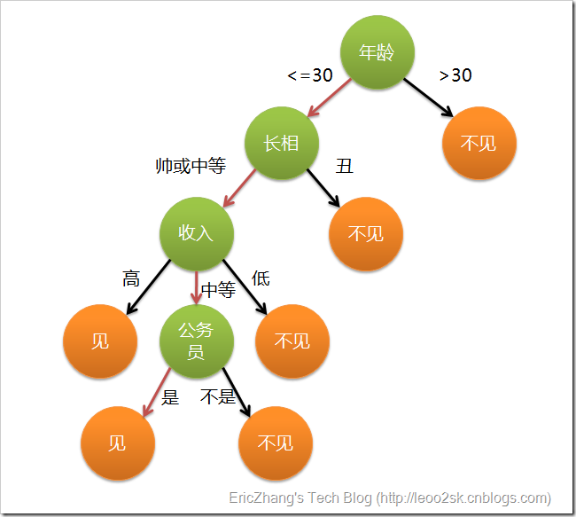
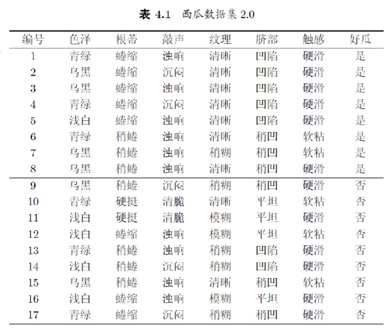
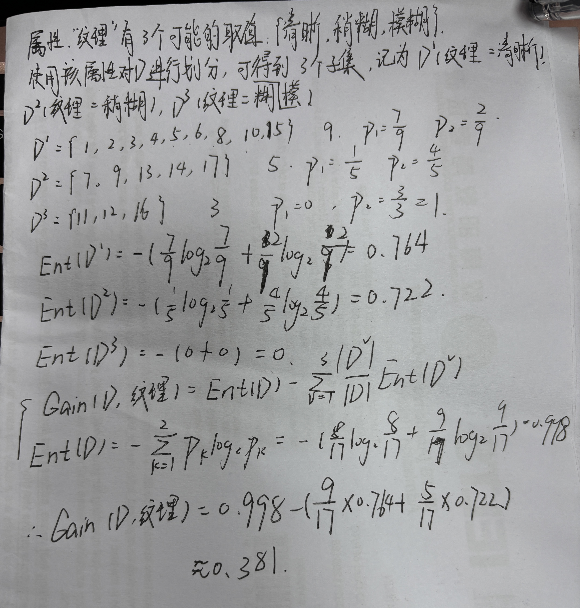
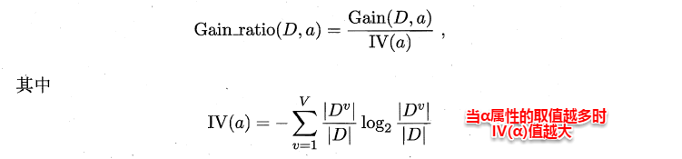
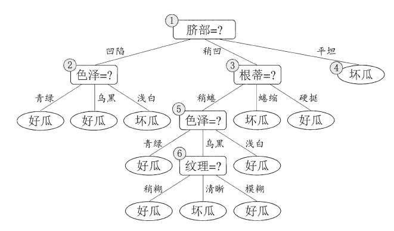
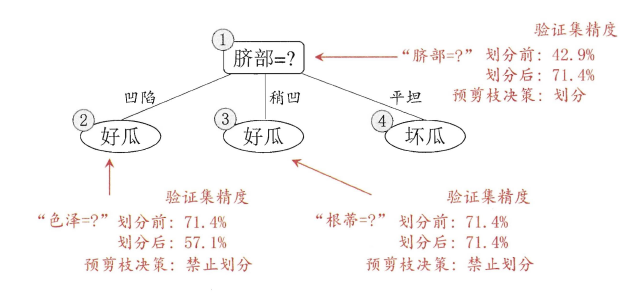
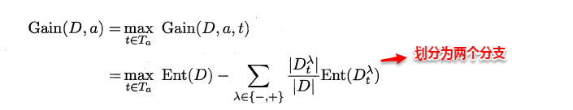
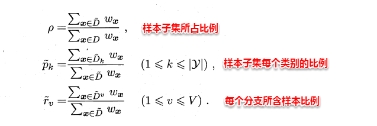
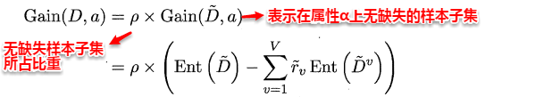
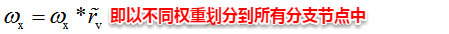

上篇主要介绍和讨论了线性模型。首先从最简单的最小二乘法开始，讨论输入属性有一个和多个的情形，接着通过广义线性模型延伸开来，将预测连续值的回归问题转化为分类问题，从而引入了对数几率回归，最后线性判别分析LDA将样本点进行投影，多分类问题实质上通过划分的方法转化为多个二分类问题进行求解。本篇将讨论另一种被广泛使用的分类算法--决策树（Decision Tree）。

# **4、决策树**

## **4.1 决策树基本概念**



在上图的决策树中，决策过程的每一次判定都是对某一属性的“测试”，决策最终结论则对应最终的判定结果。一般一颗决策树包含：一个根节点、若干个内部节点和若干个叶子节点，易知：

* 每个**非叶节点**表示一个**特征属性测试test**。
* 每个分支代表这个特征属性在某个值域上的输出。
* 每个“叶结点”对应于一个“预测结果”
* 每个节点包含的样本集合通过属性测试被划分到子节点中，根节点包含样本全集。

---

* 学习过程：通过**对训练样本的分析**来确定“**划分属性**”(即内部结点所对应的属性） 
* 预测过程：将测试示例从根结点开始， 沿着划分属性所构成的“判定测试序列”下行，直到叶结点

## **4.2 决策树的构造**

决策树的构造是一个递归的过程，有三种情形会导致递归返回：

+ 当前结点包含的样本**全属于同一类别**，这时直接将该节点标记为**叶节点**，并设为相应的类别；
+ 当前属性集为空，或是所有样本在所有属性上取值相同，无法划分，这时将该节点标记为叶节点，并将其类别设为该节点所含样本最多的类别；
+ 当前结点包含的样本集合为空，不能划分，这时也将该节点标记为叶节点，并将其类别设为父节点中所含样本最多的类别。

算法的基本流程如下图所示：

```cpp
输入：训练集 D = {(x1,y1), (x2, y2),...,(xm,ym)};
		 属性集 A = {a1,a2,...,ad}.
过程：函数 TreeGenerate(D,A)
 1. 生成结点node;
 2. if D 中样本全属于同一类别C then
 3. 		将node标记为C类叶结点; return			// 终止条件1（最好的情形）
 4. end if
 5. if A = NULL or D中样本在A上取值相同 then
 6.    将node标记为叶结点，其类别标记为D中样本数最多的类; return		// 终止条件2（属性用完或分不开情形，使用后验分布）
 7. end if
 8. 从A中选择最优划分属性a[*];		// 决策树算法的核心
 9. for a[*] 的每一个值a[*][v] do		// 若为连续值属性，则只有两个分支（<= 与 >）
10.    为node生成一个分支; 令D[v] 表示 D 中在a[*]上取值为a[*][v]的样本子集;
11.    if D[v]为空 then
12.       将分支结点标记为叶结点，其类别标记为D中样本最多的类； return    // 终止条件3（分支为空，使用先验分布）
13.    else
14.      以 TreeGenerate(D[v], A\{a[*]})为分支结点//若a[*]为连续属性，不用去除，寻找下一个最优划分点可继续作子结点的划分属性
15.    end if
16. end for
输出： 以node为根结点的一课决策树
```

什么是后验分布？
??? note "note" 
     先验分布和后验分布是贝叶斯统计中的两个重要概念。它们在处理概率和不确定性时提供了强大的工具，尤其在决策树和其他机器学习算法中。

     ### 先验分布（Prior Distribution）
    
    先验分布表示在看到数据之前对某个参数的信念或了解。它是基于之前的经验或已有的知识进行的假设。
     
     #### 示例
    
    假设你在一个箱子里有红球和蓝球，但你不知道它们的比例。你可能会假设每种颜色的球的数量是均等的，即 50% 红球和 50% 蓝球。这就是先验分布。
     
     在数学上，如果我们用 $P(H)$ 表示先验概率，其中 $H$ 是某个假设或参数（比如红球和蓝球的比例），则先验分布反映了在没有观察任何数据之前对这个参数的初始估计。
    
     ### 后验分布（Posterior Distribution）
    
    后验分布是在看到数据之后对某个参数的更新的信念。它结合了先验分布和新的数据，提供了一个修正后的概率分布。
     
     后验分布通过贝叶斯定理计算：
     
    $$
     P(H|D) = \frac{P(D|H) \cdot P(H)}{P(D)}
    $$
    
     其中：
     
     - $P(H|D)$ 是在给定数据 $D$ 之后的后验概率。
    - $P(D|H)$ 是在假设 $H$ 为真的情况下观测到数据 $D$ 的可能性，即似然函数。
     - $P(H)$ 是先验概率。
     - $P(D)$ 是数据的边缘似然，通常作为一个归一化常数来确保后验概率的总和为 1。
     
     #### 示例
    
    假设你最初认为红球和蓝球的比例是均等的（先验分布），但你从箱子里抽出了10个球，其中7个是红球，3个是蓝球。基于这个新数据，你会更新你对红球和蓝球比例的估计。新的估计就是后验分布。
     
     ### 应用
    
    在决策树中，先验和后验分布的概念可以用于处理节点分类和概率估计。例如：
     
     - **先验分布**：在构建决策树的初始阶段，假设每个类别的样本数量相同或基于训练集中类别的分布。
    - **后验分布**：当分裂到某个节点时，利用该节点的数据更新类别的概率分布。如果在某个节点上分裂后样本数量很少或没有样本，则可以使用父节点的后验分布作为估计。
    
     ### 举个具体例子
    
    假设你在构建决策树时遇到一个节点，其中所有属性都用尽了，或者样本在所有属性上的取值都相同（无法再分裂）。此时你会：
     1. **先验分布**：假设每个类别的样本数量是均等的，或者使用在整个训练集中每个类别的比例作为先验分布。
     2. **后验分布**：基于当前节点的数据更新类别的分布。如果某个类别的样本数量更多，则该类别的概率更高。这就是后验分布。
     
     ### 总结
    
    - **先验分布**：表示在观察数据之前对参数的初始信念。
     - **后验分布**：表示在观察数据之后更新后的信念，结合了先验知识和新数据。
     
     这两个概念在贝叶斯统计中帮助我们不断更新和改进对参数的估计，尤其在处理不确定性和概率问题时。


可以看出：决策树学习的关键在于**如何选择划分属性**，不同的划分属性得出不同的分支结构，从而影响整颗决策树的性能。属性划分的目标是让各个划分出来的子节点尽可能地“纯”，即属于同一类别。因此下面便是介绍量化纯度的具体方法，决策树最常用的算法有三种：ID3，C4.5和CART。

## 4.3 信息增益（ID3算法使用)

#### 熵的定义

ID3算法使用**信息增益**为准则来选择划分属性，**“信息熵”(information entropy)**是度量样本结合纯度的常用指标，假定当前样本集合$D$中第k类样本所占比例为$p_k$，则样本集合$D$的信息熵定义为：

$$
Ent(D) = -\sum^{|y|}_{k=1}p_klog_2p_k
$$

其中：

- $|y|$ 是类别的总数。
- $p_k$ 是类别 $k$ 的样本所占的比例。

#### 熵的性质

熵是衡量数据集纯度的一种度量方法：

- 当熵值较小，数据集的纯度较高，即大部分样本属于同一个类别。
- 当熵值较大，数据集的纯度较低，即样本的类别分布较为均匀。

#### 特殊值的解释

1. **熵的最小值：0**
	- 当数据集 $D$ 中所有样本都属于同一个类别时，熵 $\text{Ent}(D)$ 为 0。
	- 这表示数据集是完全纯净的，没有任何不确定性。
	- 数学上，如果 $p_k = 1$（唯一一个类别占所有样本）且其他 $p_j = 0$（其他类别不存在），则：$\text{Ent}(D) = -1 \cdot \log_2 1 = 0$

2. **熵的最大值：$\log_2(|y|)$**
	- 当数据集中每个类别的样本数量相同时，熵达到最大值。
	- 这表示数据集的不确定性最高，即每个类别的样本比例都是 $\frac{1}{|y|}$。
	- 数学上，如果 $p_k = \frac{1}{|y|}$ 对所有 $k$ 成立，则：$\text{Ent}(D) = -\sum_{k=1}^{|y|} \frac{1}{|y|} \log_2 \frac{1}{|y|} = -\log_2 \frac{1}{|y|} = \log_2 |y|$

## 4.4 信息增益

假定通过属性划分样本集$D$，产生了$V$个分支节点，$v$表示其中第$v$个分支节点，易知：分支节点包含的样本数越多，表示该分支节点的影响力越大。故可以计算出划分后相比原始数据集$D$​获得的“**信息增益**”（information gain）。

$$
Gain(D,a)=Ent(D)-\sum^V_{v=1}\frac{|D^v|}{|D|}Ent(D^v)
$$

+ 信息增益越大，表示使用该属性划分样本集D的效果越好，因此ID3算法在递归过程中，每次选择最大信息增益的属性作为当前的划分属性。

  其中：
  
  - $\text{Gain}(D, a)$ 是数据集 $D$ 在属性 $a$ 上的信息增益。
  - $\text{Ent}(D)$ 是数据集 $D$ 的熵。
  - $V$ 是属性  $a$ 的不同取值的数量。
  - $|D^v|$ 是属性 $a$ 取值为 $v$ 的样本子集的大小。
  - $\frac{|D^v|}{|D|}$ 是属性 $a$ 取值为 $v$ 的样本子集占数据集 $D$ 的比例。
  - $\text{Ent}(D^v)$ 是属性 $a$ 取值为 $$ v $$ 的样本子集 $D^v$ 的熵。


#### 步骤
1. **计算数据集 $D$ 的初始熵 $\text{Ent}(D)$**。
2. **对每个属性 $a$ 的每个可能取值 $v$**，计算在该取值下的数据子集 $D^v$ 的熵 $\text{Ent}(D^v)$。
3. **计算所有这些子集熵的加权平均**，权重是每个子集在总数据集中的比例。
4. **用初始熵减去加权平均后的子集熵**，得到属性 $a$​ 的信息增益。





## **4.5 C4.5算法**（增益率）

ID3算法存在一个问题，就是偏向于取值数目较多的属性，例如：如果存在一个唯一标识，这样样本集D将会被划分为|D|个分支，每个分支只有一个样本，这样划分后的信息熵为零，十分纯净，但是对分类毫无用处。因此C4.5算法使用了“增益率”（gain ratio）来选择划分属性，来避免这个问题带来的困扰。首先使用ID3算法计算出信息增益高于平均水平的候选属性，接着C4.5计算这些候选属性的增益率，增益率定义为：

[](https://camo.githubusercontent.com/35149b345dd25f1d9b0a86f2ec8ade66a5c3a56b6eb18553a98cfeeda6117e30/68747470733a2f2f692e6c6f6c692e6e65742f323031382f31302f31372f356263373238656336393634372e706e67)

## **4.6 CART算法（基尼指数）**

基尼指数是另一种用于选择决策树最优划分属性的指标。与熵和信息增益不同，基尼指数主要用于衡量数据集的纯度。**基尼指数越小，数据集的纯度越高。**

#### 基尼指数定义

给定数据集 $D$ 中的类别分布，基尼指数定义为：

$$
\text{Gini}(D) = 1 - \sum_{k=1}^{|y|} p_k^2
$$

其中：

- $|y|$ 是类别的总数。
- $p_k$ 是数据集中属于类别 $k$ 的样本所占的比例。

#### 计算基尼指数的步骤

1. **计算数据集 $D$ 的基尼指数**：

$$
\text{Gini}(D) = 1 - \sum_{k=1}^{|y|} p_k^2
$$

2. **对于每个属性 $a$**，计算使用该属性进行划分后的基尼指数。属性 $a$ 的不同取值 $v$ 会将数据集 $D$ 划分成若干个子集 $D^v$。

3. **计算划分后的基尼指数的加权平均**：

$$
\text{Gini}(D, a) = \sum_{v=1}^{V} \frac{|D^v|}{|D|} \text{Gini}(D^v)
$$

4. **选择基尼指数最小的属性**进行划分，基尼指数越小，表示划分后的子集越纯。

#### 示例

假设我们有一个简单的数据集 $D$：
```
样本1：{天气: 晴, 类别: 去玩}
样本2：{天气: 晴, 类别: 去玩}
样本3：{天气: 阴, 类别: 不去}
样本4：{天气: 阴, 类别: 不去}
```

我们希望计算属性“天气”的基尼指数。

1. **计算数据集 $D$ 的基尼指数**：

   - 类别“去玩”的比例 $p(去玩) = \frac{2}{4} = 0.5$
   - 类别“不去”的比例 $p(不去) = \frac{2}{4} = 0.5$

$$
\text{Gini}(D) = 1 - (0.5^2 + 0.5^2) = 1 - 0.25 - 0.25 = 0.5
$$

2. **计算属性“天气”的不同取值（晴、阴）在不同子集的基尼指数**：
   - “天气”取值为“晴”的子集 $D^{晴}$ 包含样本1和样本2：

$$
\text{Gini}(D^{晴}) = 1 - (1^2 + 0^2) = 0
$$

   - “天气”取值为“阴”的子集 $D^{阴}$ 包含样本3和样本4：

$$
\text{Gini}(D^{阴}) = 1 - (1^2 + 0^2) = 0 
$$

3. **计算划分后的基尼指数的加权平均**：
   - “晴”的子集大小 $|D^{晴}| = 2$
   - “阴”的子集大小 $|D^{阴}| = 2$

$$
\text{Gini}(D, \text{天气}) = \frac{2}{4} \cdot 0 + \frac{2}{4} \cdot 0 = 0 
$$

4. **选择基尼指数最小的属性**：
   - 在这个示例中，属性“天气”划分后的基尼指数为0，表示该划分是非常好的。

---

基尼指数用于衡量数据集的纯度，计算属性划分的好坏。基尼指数越小，数据集越纯，属性越适合作为划分属性。在决策树算法中，如CART（Classification and Regression Tree），基尼指数常用来选择最优划分属性。

## 4.7 剪枝处理

从决策树的构造流程中我们可以直观地看出：不管怎么样的训练集，决策树总是能很好地将各个类别分离开来，这时就会遇到之前提到过的问题：过拟合（overfitting），即太依赖于训练样本。剪枝（pruning）则是决策树算法对付过拟合的主要手段，剪枝的策略有两种如下：


* **预剪枝（prepruning）**：在构造的过程中**先评估，再考虑是否分支**。
* **后剪枝（post-pruning）**：在构造好一颗完整的决策树后，**自底向上，评估分支的必要性**。


评估指的是性能度量，即决策树的泛化性能。之前提到：可以使用测试集作为学习器泛化性能的近似，因此可以将数据集划分为训练集和测试集。预剪枝表示在构造数的过程中，对一个节点考虑是否分支时，首先计算决策树不分支时在测试集上的性能，再计算分支之后的性能，若分支对性能没有提升，则选择不分支（即剪枝）。后剪枝则表示在构造好一颗完整的决策树后，从最下面的节点开始，考虑该节点分支对模型的性能是否有提升，若无则剪枝，即将该节点标记为叶子节点，类别标记为其包含样本最多的类别。






上图分别表示不剪枝处理的决策树、预剪枝决策树和后剪枝决策树。预剪枝处理使得决策树的很多分支被剪掉，因此大大降低了训练时间开销，同时降低了过拟合的风险，但另一方面由于剪枝同时剪掉了当前节点后续子节点的分支，因此预剪枝“贪心”的本质阻止了分支的展开，在一定程度上带来了**欠拟合**的风险。而后剪枝则通常保留了更多的分支，因此采用后剪枝策略的决策树性能往往优于预剪枝，但其自底向上遍历了所有节点，并计算性能，**训练时间开销相**比预剪枝大大提升。

## **4.8 连续值与缺失值处理**

对于连续值的属性，若每个取值作为一个分支则显得不可行，因此需要进行离散化处理，常用的方法为二分法，基本思想为：给定样本集$D$与连续属性$α$，二分法试图找到一个划分点$t$将样本集$D$在属性$α$上分为$≤t$与$＞t$。

* 首先将$α$的所有取值按升序排列，所有相邻属性的均值作为候选划分点（$n-1$个，$n$为$α$所有的取值数目）。
* 计算每一个划分点划分集合$D$（即划分为两个分支）后的信息增益。
* 选择最大信息增益的划分点作为最优划分点。



现实中常会遇到不完整的样本，即某些属性值缺失。有时若简单采取剔除，则会造成大量的信息浪费，因此在属性值缺失的情况下需要解决两个问题：

（1）如何选择划分属性。

（2）给定划分属性，若某样本在该属性上缺失值，如何划分到具体的分支上。假定为样本集中的每一个样本都赋予一个权重，根节点中的权重初始化为1，则定义：



对于（1）：通过在样本集D中选取在属性α上没有缺失值的样本子集，计算在该样本子集上的信息增益，最终的信息增益等于该样本子集划分后信息增益乘以样本子集占样本集的比重。即：



对于（2）：若该样本子集在属性α上的值缺失，则将该样本以不同的权重（即每个分支所含样本比例）划入到所有分支节点中。该样本在分支节点中的权重变为：


