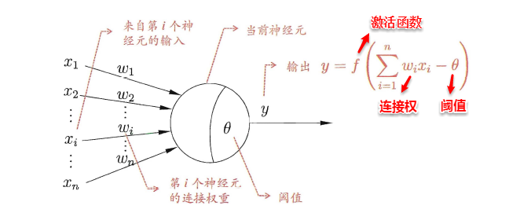
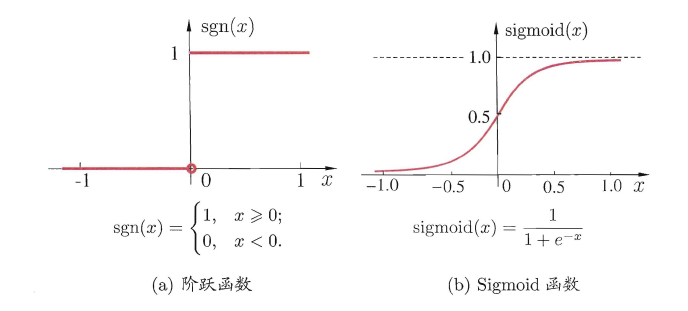
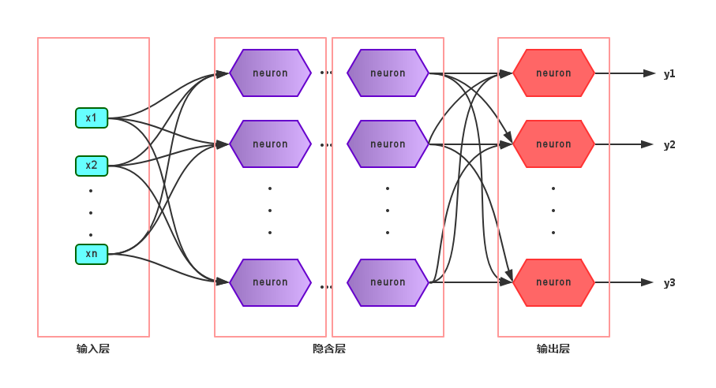
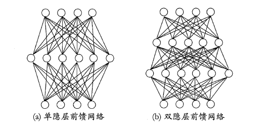
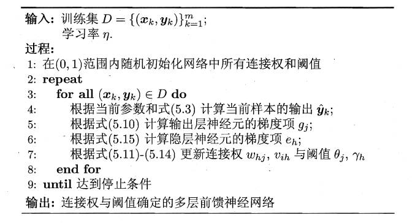
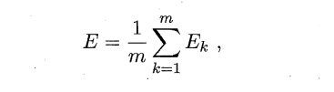
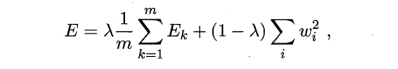
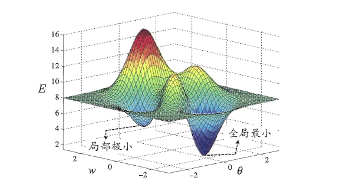
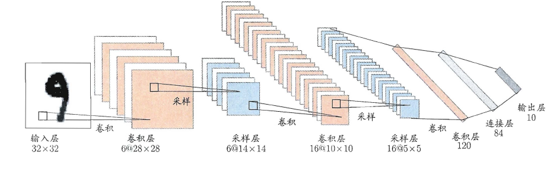

上篇主要讨论了决策树算法。首先从决策树的基本概念出发，引出决策树基于树形结构进行决策，进一步介绍了构造决策树的递归流程以及其递归终止条件，在递归的过程中，划分属性的选择起到了关键作用，因此紧接着讨论了三种评估属性划分效果的经典算法，介绍了剪枝策略来解决原生决策树容易产生的过拟合问题，最后简述了属性连续值/缺失值的处理方法。本篇将讨论现阶段十分热门的另一个经典监督学习算法--神经网络（neural network）。

# **5、神经网络**

在机器学习中，神经网络一般指的是“神经网络学习”，是机器学习与神经网络两个学科的交叉部分。所谓神经网络，目前用得最广泛的一个定义是“神经网络是由具有适应性的简单单元组成的广泛并行互连的网络，它的组织能够模拟生物神经系统对真实世界物体所做出的交互反应”。

## **5.1 神经元模型**

神经网络中最基本的单元是神经元模型（neuron）。
### M-P神经元模型
“M-P神经元模型”正是对这一结构进行了抽象，也称“**阈值(threshold)**逻辑单元“，其中树突对应于输入部分，每个神经元收到n个其他神经元传递过来的输入信号，这些信号通过带权重的连接传递给细胞体，这些权重又称为**连接权（connection weight**）。细胞体分为两部分，前一部分计算总输入值（即输入信号的加权和，或者说累积电平），后一部分先计算总输入值与该神经元阈值的差值，然后通过**激活函数（activation function）**的处理，产生输出从轴突传送给其它神经元。M-P神经元模型如下图所示：

### Sigmoid函数

与线性分类十分相似，神经元模型最理想的激活函数也是阶跃函数，即将神经元输入值与阈值的差值映射为输出值1或0，若差值大于零输出1，对应兴奋；若差值小于零则输出0，对应抑制。但阶跃函数不连续，不光滑，故在M-P神经元模型中，也采用Sigmoid函数来近似， **Sigmoid函数将较大范围内变化的输入值挤压到 (0,1) 输出值范围内，所以也称为挤压函数（squashing function）**。

$$
sigmoid(x)=\frac{1}{1+e^{-x}}
$$

#### 为什么不能在深度学习中广泛适用sigmoid函数作为激活函数，请列式并加以说明？

在深度学习中，虽然Sigmoid函数作为激活函数在早期神经网络中被广泛使用，但在现代深度学习中，它的使用已经减少。这主要是由于Sigmoid函数在深层神经网络中存在一些问题，限制了它的广泛应用。以下是这些问题的详细说明和数学推导：

1. 梯度消失问题（Vanishing Gradient Problem）

数学背景：
Sigmoid函数的定义如下：

$$
\sigma(x) = \frac{1}{1 + e^{-x}}
$$

Sigmoid函数的导数为：

$$
\sigma'(x) = \sigma(x)(1 - \sigma(x)) = \frac{e^{-x}}{(1 + e^{-x})^2}
$$

梯度消失问题的推导：

- 在输入值 $x$ 绝对值很大时，Sigmoid函数的输出趋近于0或1。这意味着其导数 $\sigma'(x)$ 会趋近于0。
- 当激活函数的导数趋近于0时，在反向传播过程中计算得到的梯度会逐层减小，导致前层参数更新很小或几乎不更新，导致训练变慢或者模型无法有效训练。

举个例子，假设一个简单的三层神经网络，激活函数均为Sigmoid。设输入为 $x$，输出为 $y$，权重分别为 $W_1, W_2, W_3$，则有：

$$
h_1 = \sigma(W_1 \cdot x)
$$

$$
h_2 = \sigma(W_2 \cdot h_1)
$$

$$
y = \sigma(W_3 \cdot h_2)
$$

在反向传播中，损失函数对输入的梯度为：

$$
\frac{\partial L}{\partial x} = \frac{\partial L}{\partial y} \cdot \frac{\partial y}{\partial h_2} \cdot \frac{\partial h_2}{\partial h_1} \cdot \frac{\partial h_1}{\partial x} 
$$

每一项的导数中都包含Sigmoid函数的导数。如果每层导数都接近0，那么最终的梯度也会非常小，导致梯度消失。

2.输出不为零中心（Non-zero-centered Output）

Sigmoid函数的输出范围是 (0, 1)，不对称且不以零为中心。这样会导致梯度更新时产生偏移，即每一层的激活值总是非负，影响梯度下降过程的效率。

3.计算复杂度

Sigmoid函数包含指数运算，相较于其他激活函数（如ReLU）的简单计算，它的计算复杂度更高，增加了计算负担。

#### 替代激活函数

由于上述原因，现代深度学习更常用以下激活函数：

1. ReLU (Rectified Linear Unit)

$$
\text{ReLU}(x) = \max(0, x)
$$

- ReLU函数解决了梯度消失问题，因为它在 \(x > 0\) 时的梯度始终为1。
- ReLU输出以零为中心，在正半轴上没有饱和区。
- 计算简单，只需比较大小。

**总结**

Sigmoid函数在深度学习中的广泛应用受限于其梯度消失问题、输出不为零中心以及计算复杂度高的问题。现代深度学习更倾向于使用如ReLU、Leaky ReLU和Tanh等更有效的激活函数，以提高训练效率和模型性能。

将多个神经元按一定的层次结构连接起来，就得到了神经网络。它是一种包含多个参数的模型，比方说10个神经元两两连接，则有100个参数需要学习（每个神经元有9个连接权以及1个阈值），若将每个神经元都看作一个函数，则整个神经网络就是由这些函数相互嵌套而成。

## **5.2 感知机与多层网络**

### 感知机

+ 感知机（Perceptron）/“阈值逻辑单元 ”(threshold logic unit).
+ 是由两层神经元组成的一个简单模型
  + 输入层接收外界输入信号后传递给输出层
    + 输入层只是接受外界信号（样本属性）并传递给输出层（输入层的神经元个数等于样本的属性数目），而没有激活函数。
  + 输出层是M-P神经元 
    + 只有输出层是M-P神经元，即只有输出层神经元进行激活函数处理，也称为**功能神经元（functional neuron）**；

这样一来，感知机与之前线性模型中的对数几率回归的思想基本是一样的，都是通过对属性加权与另一个常数求和，再使用sigmoid函数将这个输出值压缩到0-1之间，从而解决分类问题。不同的是感知机的输出层应该可以有多个神经元，从而可以实现多分类问题，同时两个模型所用的参数估计方法十分不同。

给定训练集，则感知机的$n+1$个参数（$n$个权重+1个阈值）都可以通过学习得到。阈值$Θ$可以看作一个输入值固定为-1的哑结点的权重$ωn+1$，即假设有一个固定输入$xn+1=-1$的输入层神经元，其对应的权重为$ωn+1$，这样就把权重和阈值统一为权重的学习了。简单感知机的结构如下图所示：

### 感知机权重的学习规则

感知机权重的学习规则如下：对于训练样本$(x，y)$，当该样本进入感知机学习后，会产生一个输出值，若该输出值与样本的真实标记不一致，则感知机会对权重进行调整，若激活函数为阶跃函数，则调整的方法为（**基于梯度下降法**）：

其中 $η∈(0，1)$ 称为学习率，可以看出感知机是通过逐个样本输入来更新权重，首先设定好初始权重（一般为随机），逐个地输入样本数据，若输出值与真实标记相同则继续输入下一个样本，若不一致则更新权重，然后再重新逐个检验，直到每个样本数据的输出值都与真实标记相同。容易看出：感知机模型总是能将训练数据的每一个样本都预测正确，和决策树模型总是能将所有训练数据都分开一样，感知机模型很容易产生过拟合问题。

### 多层神经网络

由于感知机模型只有一层功能神经元，因此其功能十分有限，只能处理线性可分的问题，对于这类问题，感知机的学习过程一定会收敛（converge），因此总是可以求出适当的权值。但是对于像书上提到的异或问题，只通过一层功能神经元往往不能解决，因此要解决非线性可分问题，需要考虑使用多层功能神经元，即神经网络。多层神经网络的拓扑结构如下图所示：

在神经网络中，**输入层与输出层之间的层称为隐含层或隐层（hidden layer）**，隐层和输出层的神经元都是具有激活函数的功能神经元。只需包含一个隐层便可以称为多层神经网络，常用的神经网络称为“多层前馈神经网络”（multi-layer feedforward neural network），该结构满足以下几个特点：

* 每层神经元与下一层神经元之间完全互连
* 神经元之间不存在同层连接
* 神经元之间不存在跨层连接

根据上面的特点可以得知：这里的**“前馈”指的是网络拓扑结构中不存在环或回路**，而不是指该网络只能向前传播而不能向后传播（下节中的BP神经网络正是基于前馈神经网络而增加了反馈调节机制）。神经网络的学习过程就是根据训练数据来调整神经元之间的“连接权”以及每个神经元的阈值，换句话说：神经网络所学习到的东西都蕴含在网络的连接权与阈值中。

## 5.3 BP 误差逆传播（重要）

会算逆向就行 不用copy公式

https://blog.csdn.net/weixin_40650126/article/details/107723925

由上面可以得知：神经网络的学习主要蕴含在权重和阈值中，多层网络使用上面简单感知机的权重调整规则显然不够用了，BP神经网络算法即**误差逆传播算法（error BackPropagation）**正是为学习多层前馈神经网络而设计，BP神经网络算法是迄今为止最成功的的神经网络学习算法。

一般而言，只需包含一个足够多神经元的隐层，就能以任意精度逼近任意复杂度的连续函数[Hornik et al.,1989]，故下面以训练单隐层的前馈神经网络为例，介绍BP神经网络的算法思想。

上图为一个单隐层前馈神经网络的拓扑结构，BP神经网络算法也使用**梯度下降法（gradient descent）**，以单个样本的均方误差的负梯度方向对权重进行调节。可以看出：BP算法首先将误差反向传播给隐层神经元，调节隐层到输出层的连接权重与输出层神经元的阈值；接着根据隐含层神经元的均方误差，来调节输入层到隐含层的连接权值与隐含层神经元的阈值。BP算法基本的推导过程与感知机的推导过程原理是相同的，下面给出调整隐含层到输出层的权重调整规则的推导过程：

学习率$η∈(0，1)$控制着沿反梯度方向下降的步长，若步长太大则下降太快容易产生震荡，若步长太小则收敛速度太慢，一般地常把$η$设置为0.1，有时更新权重时会将输出层与隐含层设置为不同的学习率。BP算法的基本流程如下所示：

BP算法的更新规则是基于每个样本的预测值与真实类标的均方误差来进行权值调节，即BP算法每次更新只针对于单个样例。需要注意的是：BP算法的最终目标是要最小化整个训练集D上的累积误差，即：

如果基于累积误差最小化的更新规则，则得到了累积误差逆传播算法（accumulated error backpropagation），即每次读取全部的数据集一遍，进行一轮学习，从而基于当前的累积误差进行权值调整，因此参数更新的频率相比标准BP算法低了很多，但在很多任务中，尤其是在数据量很大的时候，往往标准BP算法会获得较好的结果。另外对于如何设置隐层神经元个数的问题，至今仍然没有好的解决方案，常使用“试错法”进行调整。

前面提到，BP神经网络强大的学习能力常常容易造成过拟合问题，有以下两种策略来缓解BP网络的过拟合问题：

- 早停：将数据分为训练集与测试集，训练集用于学习，测试集用于评估性能，若在训练过程中，训练集的累积误差降低，而测试集的累积误差升高，则停止训练。
- 引入正则化（regularization）：基本思想是在累积误差函数中增加一个用于描述网络复杂度的部分，例如所有权值与阈值的平方和，其中λ∈（0,1）用于对累积经验误差与网络复杂度这两项进行折中，常通过交叉验证法来估计。

## **5.4 全局最小与局部最小**

模型学习的过程实质上就是一个寻找最优参数的过程，例如BP算法试图通过最速下降来寻找使得累积经验误差最小的权值与阈值，在谈到最优时，一般会提到局部极小（local minimum）和全局最小（global minimum）。

* 局部极小解：参数空间中的某个点，其**邻域点**的误差函数值均不小于该点的误差函数值。
* 全局最小解：参数空间中的某个点，所有其他点的误差函数值均不小于该点的误差函数值。

要成为局部极小点，只要满足该点在参数空间中的梯度为零。局部极小可以有多个，而全局最小只有一个。全局最小一定是局部极小，但局部最小却不一定是全局最小。显然在很多机器学习算法中，都试图找到目标函数的全局最小。梯度下降法的主要思想就是沿着负梯度方向去搜索最优解，负梯度方向是函数值下降最快的方向，若迭代到某处的梯度为0，则表示达到一个局部最小，参数更新停止。因此在现实任务中，通常使用以下策略尽可能地去接近全局最小。

* 以多组不同参数值初始化多个神经网络，按标准方法训练，迭代停止后，取其中误差最小的解作为最终参数。
* 使用“模拟退火”技术，这里不做具体介绍。
* 使用随机梯度下降，即在计算梯度时加入了随机因素，使得在局部最小时，计算的梯度仍可能不为0，从而迭代可以继续进行。

## **5.5 深度学习**

理论上，参数越多，模型复杂度就越高，容量（capability）就越大，从而能完成更复杂的学习任务。深度学习（deep learning）正是一种极其复杂而强大的模型。

怎么增大模型复杂度呢？两个办法，**一是增加隐层的数目**，二是增加隐层神经元的数目。前者更有效一些，因为**它不仅增加了功能神经元的数量，还增加了激活函数嵌套的层数**。但是对于多隐层神经网络，经典算法如标准BP算法往往会在误差逆传播时发散（diverge），无法收敛达到稳定状态。

那要怎么有效地训练多隐层神经网络呢？一般来说有以下两种方法：

- **无监督逐层训练（unsupervised layer-wise training）**：每次训练一层隐节点，把上一层隐节点的输出当作输入来训练，本层隐结点训练好后，输出再作为下一层的输入来训练，这称为**预训练（pre-training）**。全部预训练完成后，再对整个网络进行微调（fine-tuning）训练。一个典型例子就是深度信念网络（deep belief network，简称DBN）。这种做法其实可以视为把大量的参数进行分组，先找出每组较好的设置，再基于这些局部最优的结果来训练全局最优。

- 权共享（weight sharing）：**令同一层神经元使用完全相同的连接权**，典型的例子是卷积神经网络（Convolutional Neural Network，简称CNN）。这样做可以大大减少需要训练的参数数目。

深度学习可以理解为一种特征学习（feature learning）或者表示学习（representation learning），无论是DBN还是CNN，都是通过多个隐层来把与输出目标联系不大的初始输入转化为与输出目标更加密切的表示，使原来只通过单层映射难以完成的任务变为可能。即通过多层处理，逐渐将初始的“低层”特征表示转化为“高层”特征表示，从而使得最后可以用简单的模型来完成复杂的学习任务。

传统任务中，样本的特征需要人类专家来设计，这称为特征工程（feature engineering）。特征好坏对泛化性能有至关重要的影响。而深度学习为全自动数据分析带来了可能，可以自动产生更好的特征。