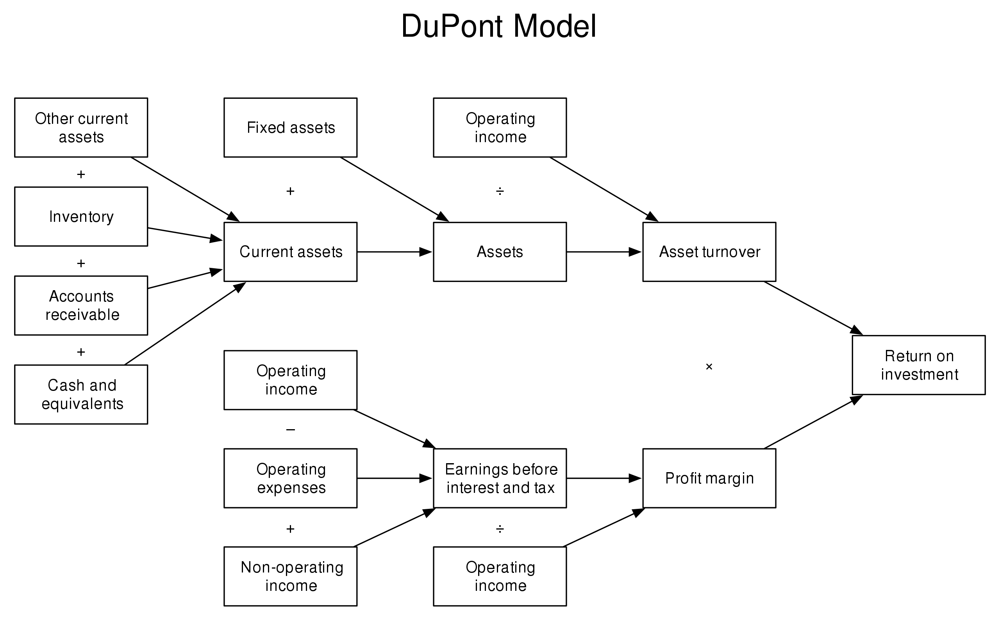

# OVERALL

注：文章为学习整理，并非原创，参考链接见底部参考链接，侵权删。

## 概念

### 是什么

+ 数据分析是一种客观认知世界并改造世界的基础方法
  + 观测

    + > 通过一些技术手段获得数据，并对数据分析与测量
      >
      > 目的：对事务形成客观量化的认知

    + 观察（采集数据、储存数据、展示数据）

    + 测量（设定标准、发现异常、研究关系）

  + 实验

    + > 通过不断提出实践假设，并基于观测的数据**验证假设**（没有经过**数据**验证的想法都是假设
      >
      > 目的：得知哪些方法可以有效的让事物朝着人为设定的方向发展
      >
      > i.e. 每种版本各做一次，基于数据做出判断——A/B Test

  + 应用

    + > 在**实际的生产环境下使用**实验得到的技术和方法，并基于数据不断迭代
      >
      > 目的：使用实验得到的新方法有效提升生产力，从而更好地创造价值

    + 基于数据反馈不断迭代产品和业务策略

		> 明确目标+拆解指标

    + 基于数据训练算法，让机器自动化完成工作（ML）

+ 实用、高效、简单

## 应用数据创造价值的方法

### 基于数据反馈不断迭代产品和业务策略

#### 明确目标+拆解目标

+ 基于目标拆解各个部门各个时间合理的数据指标
+ 常用拆解方法
	+ 流程拆解法、二分法、象限拆解法、杜邦分析法...
+ 现成拆解框架
	+ AARRR，PEST，RFM，SWOT，5W1H

+ 总之，要符合MECE(Mutually Exclusive Collectively Exhaustive)法则
	+ 相互独立、完全穷尽——无重复，无遗漏
	+ [MECE法则--高手的逻辑缜密全靠它](https://zhuanlan.zhihu.com/p/144052435)

#### 准备数据

+ 从**数据库**中取，借助工具处理后搭建数据看板即可

#### 观测数据

+ 数据观测，异动归因
+ 要基于数据验证

#### 数据实验

#### 制定策略

+ 如果是产品改动，只需要不断上线数据表现更好的产品版本即可
+ 如果是业务改动，则需要将新的业务方法准确传达给业务的执行人员，并确保改动被有效地实施

#### 优化迭代

### 基于数据训练算法，让机器自动化地完成工作

#### 为算法提供明确的业务目标

+ 整个算法相当于一个函数，目标就是最后输出的y值
+ y值的选取会直接决定算法的强度
+ 既要考虑实际的业务场景，又要考虑用怎样的数据对目标进行衡量

#### 为算法提供高质量的数据

+ 设定目标后，算法会基于输入的数据越来越准确地达到所设定的目标
+ 输入的数据质量越高，算法的准确度就越高
+ 高质量的数据--》使用数据分析从大量数据中筛选

#### 判断算法是否真正创造了实际价值

+ 是否真正创造了业务价值

#### 帮助业务更好地使用算法

+ 使用数据分析的方法告诉业务，使用算法后能提升哪些业务数据，并为业务提供相应的观测方法
+ 业务从数据层面看到了算法对业务的提升，能够更深入地使用算法

## 常见的拆解方法/框架  分析模型

### 流程拆解法

+ 概念
	+ 按照流程事情发展的时间，流程、顺序、对过程进行逐一的拆解。

+ 例子
	+ 模拟网上购物流程环节，首先：打开购物APP---点击搜索---点击商品---点击购买---完成支付

类似于漏斗分析法，是一套流程分析，适用于**流程长，环节较多**，并且**随着环节的环节的进行，留存率越来越少的场景**。

### 二分法

+ 概念
	+ 二分法又可以称为二分查找，它描述了在有序集合中搜索特定值的过程
	+ 广义的二分查找是讲问题的规模尽可能地缩小到原有地一般。

+ 例子
	+ 事物分成A部分和非A部分，如"白天"，"黑夜"

### 象限拆解法

+ 概念
	+ 通过横纵坐标，将所要内容分成四个象限，**由高到低**进行分析。
	+ 有利于找到问题的共性问题，通过象限分析法，将相同特征的事件进行归因分析，总结其中共性原因
	+ 建立分组优化策略：针对投放的象限分析法， 可以针对不同象限建立优化策略

### 杜邦分析法

+ 概念
	+ 利用**几种主要的财务的财务比率之间的关系**来综合分析企业的财务状况，具体来说，它是一种用来评价公司盈利能力股东权益回报水平，从财务角度评价企业绩效的一种经典方法，其基本思想是将企业净资产收益率逐级分解为多项财务乘积，这样有助于深入分析比较企业经营业绩，由于这种分析方法最早又美国杜邦公司使用，故名杜邦分析法。
	+ 杜邦分析法有一个核心概念：**ROE，即：净资产收益率**。

### AARRR

+ 概念
	+ 用于研究**用户增长的**数据分析模型，对用户生命周期的各个环节进行拆分
	+ 形成五个关键指标，分别是acquisition（用户获取），activation（用户激活），retetion（用户留存），revenue（获得收益），referral（推荐传播）
+ 例子
	+ 
	

#### ACQUISITION

- Bounce rate
- Click-through rate 
- Customer acquisition cost 
- Lead conversion rate 

#### ACTIVATION

- Customer conversion rate
- Drop-off rate 
- Dwell time
- Time to value 

#### RETENTION

新用户成为长期用户并继续回访的过程。

- Churn rate 流失率
- Email open rate 
- Login frequency 
- Retention rate

#### REVENUE

收入包括对用户采取赚钱行动的时刻。确切地说，该操作的内容因产品而异。这可能意味着在 Eventbrite 上举办免费活动改为付费活动；对于 Netflix 来说，这可能意味着在免费试用阶段之后继续订阅。

- Customer lifetime value
- Expansion revenue
- Monthly recurring revenue
- Revenue churn 

#### REFERAL

推荐描述了用户向其他人推荐产品的任何情况。

- Net promoter score
- Purchase rate of referred customers 
- Referral rate 
- Viral cycle time

### PEST

+ 概念
	+ 对于企业的战略管理，会有很多的分析方法，用的比较多的就是PEST分析法，从政治，经济、社会技术四个方面，基于公司战略的眼光来分析企业外部宏观环境的一种方法，公司战略的制定离不开宏观环境，而PEST分析法能从个方面比较好的把握宏观环境及变化的趋势，有利于企业对生存发展的机会加以利用，对环境可能带来的威胁及早发现避开。

### RFM

知乎[数据分析(六)：RMF分析方法](https://zhuanlan.zhihu.com/p/109414528)

+ 概念
	+ RFM是3个指标的缩写，最近一次消费时间间隔（Recency），消费频率（Frequency），消费金额（Monetary）。3个指标业务不同，定义也不同，要根据业务来灵活定义。
	  1. **最近一次消费时间间隔（R）：**是指用户最近一次消费距离现在的时间 ，最近一次消费时间间隔（R），上一次消费离得越近，也就是R的值越小，用户价值越高。
	  2. **消费频率（F）：**是指用户一段时间内消费了多少次，购买频率越高，也就是F的值越大，用户价值越高。
	  3. **消费金额（M）：**是指用户一段时间内的消费金额，消费金额越高，也就是M的值越大，用户价值越高。
	+ 是根据**客户活跃程度和交易金额的贡献**，进行客户价值细分的一种方法；
	+ 主要应用于精细化运营、用户分层分析、用户会员体系建立
	+ 提升用户转化，减少用户流失，提升用户单价

我们把这3个指标按价值从低到高排序，并把这3个指标作为XYZ坐标轴，就可以把空间分为8部分。

| R_S分类 | F_S分类 | M_S分类 | 客户类型     |
| ------- | ------- | ------- | ------------ |
| 高      | 高      | 高      | 高价值客户   |
| 低      | 高      | 高      | 重点保持客户 |
| 高      | 低      | 高      | 重点发展客户 |
| 低      | 低      | 高      | 重点挽留客户 |
| 高      | 高      | 低      | 一般价值客户 |
| 低      | 高      | 低      | 一般保持客户 |
| 高      | 低      | 低      | 一般发展客户 |
| 低      | 低      | 低      | 潜在客户     |

R_S、距离当前日期越近，得分越高，最高5分，最低1分

F_S、交易频率越高，得分越高，最高5分，最低1分

M_S、交易金额越高，得分越高，最高5分，最低1分

### SWOT

+ 概念
  + SWOT分析法代表优势（strength）、劣势（weakness）、机会（opportunity）和威胁（threats）。因此，SWOT分析实际上是将对企业内部外条件各方面进行综合和概括，进而分析组织的优劣势，面临的机会和威胁的一种方法，可以通过分析帮助企业把资源和行动集中在自己的强项和有最多机会的地方。
+ S：优势、W：劣势、O：机会、T：威胁

### 5W1H

5W：who、where、when、what、why、how

即：

+ who：分析谁
+ where：取哪里的数据
+ when：取什么时候时间段数据
+ what：用什么分析方法
+ why：什么原因导致的
+ how：如何呈现最终结果。

## 参考链接

+ https://builtin.com/articles/aarrr

+ https://blog.csdn.net/qq_66446328/article/details/130961253

+ 【全网最良心的【数据分析自学课程】它来了！必备的Excel/SQL/Tableau/Python/数据黑话/产品|竞品|市场分析报告制作、数据分析启蒙免费课程教程】 https://www.bilibili.com/video/BV1ZM4y1u7uF/
